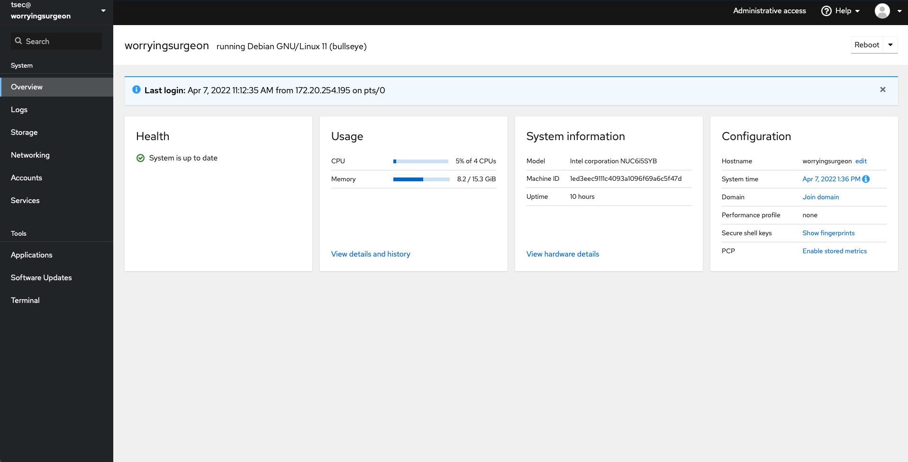
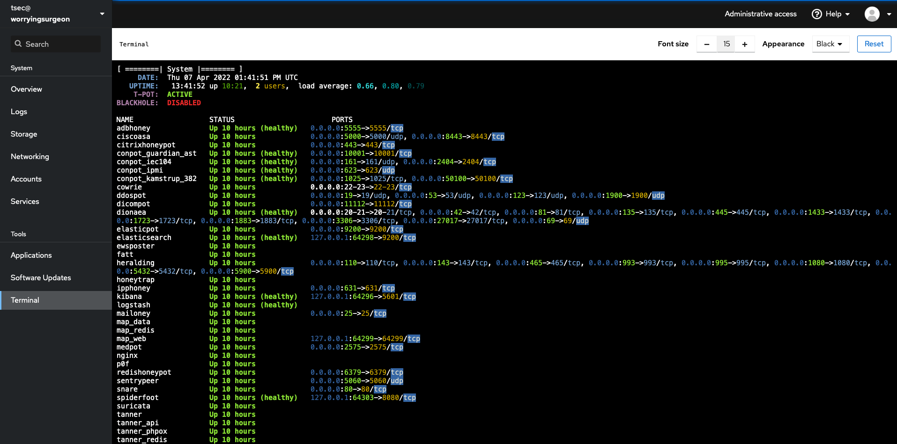
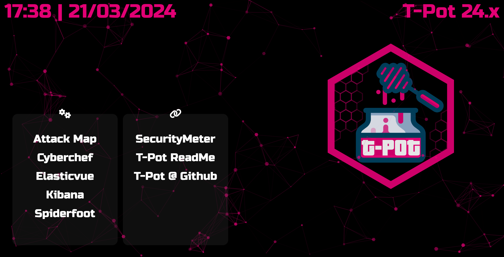
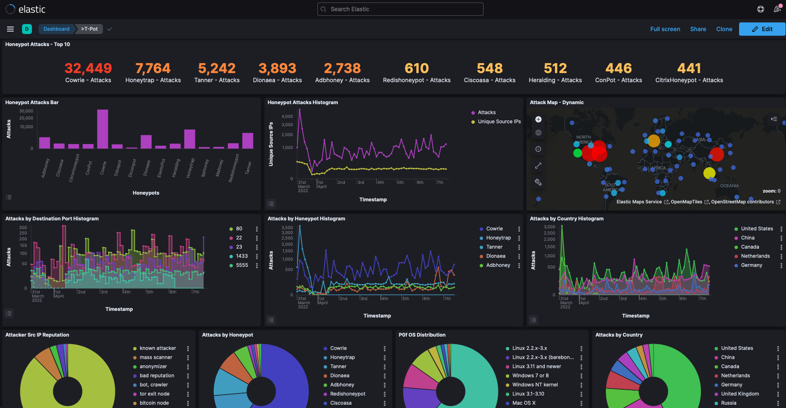
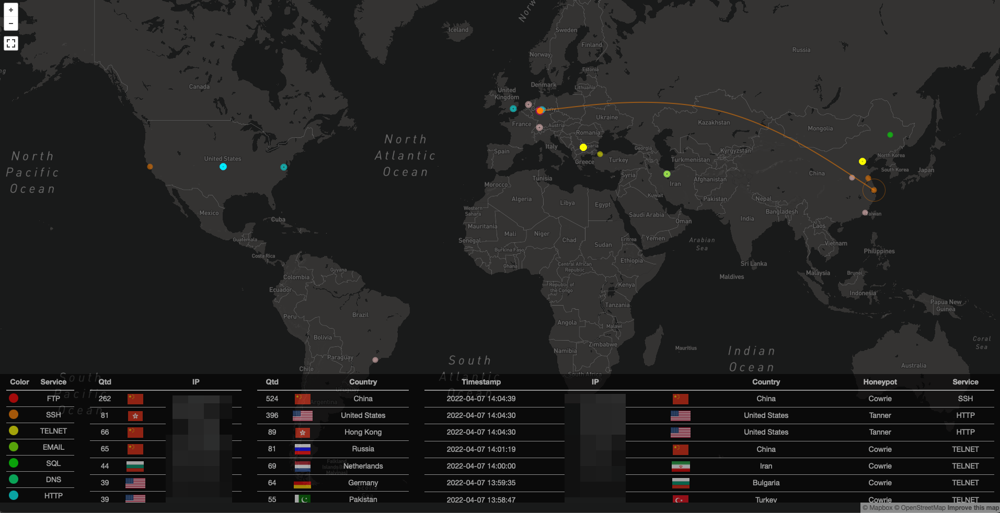
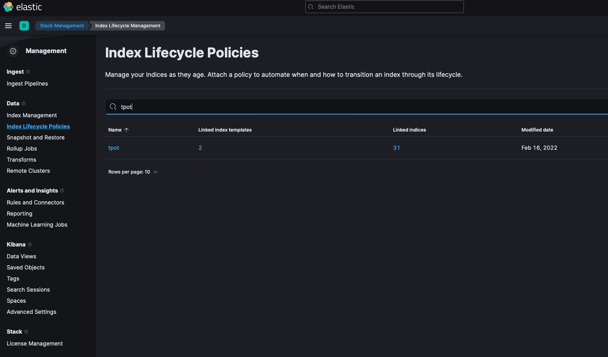
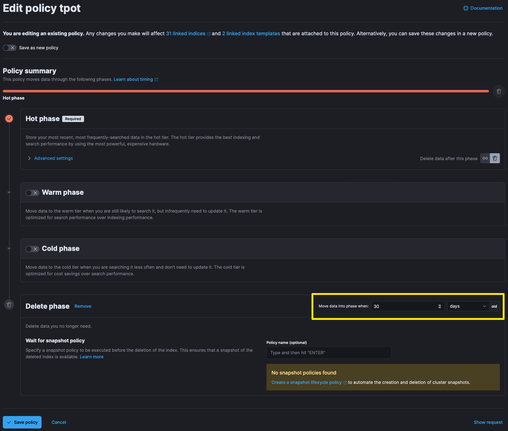

# T-Pot - The All In One Multi Honeypot Platform


T-Pot is the all in one, optionally distributed, multiarch (amd64, arm64) honeypot plattform, supporting 20+ honeypots and countless visualization options using the Elastic Stack, animated live attack maps and lots of security tools to further improve the deception experience.
<br><br>

# TL;DR
1. Meet the [system requirements](#system-requirements). The T-Pot installation needs at least 8-16 GB RAM and 128 GB free disk space as well as a working (outgoing non-filtered) internet connection.
2. Download the T-Pot ISO from [GitHub](https://github.com/telekom-security/tpotce/releases) according to your architecture (amd64, arm64) or [create it yourself](#create-your-own-iso-image).
3. Install the system in a [VM](#running-in-a-vm) or on [physical hardware](#running-on-hardware) with [internet access](#system-placement).
4. Enjoy your favorite beverage - [watch](https://sicherheitstacho.eu) and [analyze](#kibana-dashboard).
<br><br>

# Table of Contents
- [Disclaimer](#disclaimer)
- [Technical Concept](#technical-concept)
  - [Technical Architecture](#technical-architecture)
  - [Services](#services)
  - [User Types](#user-types)
- [System Requirements](#system-requirements)
  - [Running in a VM](#running-in-a-vm)
  - [Running on Hardware](#running-on-hardware)
  - [Running in a Cloud](#running-in-a-cloud)
  - [Required Ports](#required-ports)
- [System Placement](#system-placement)
- [Installation](#installation)
  - [ISO Based](#iso-based)
    - [Download ISO Image](#download-iso-image)
    - [Create your own ISO Image](#create-your-own-iso-image)
  - [Post Install](#post-install)
    - [Download Debian Netinstall Image](#download-debian-netinstall-image)
    - [Post Install User Method](#post-install-user-method)
    - [Post Install Auto Method](#post-install-auto-method)
  - [T-Pot Installer](#t-pot-installer)
    - [Installation Types](#installation-types)
    - [Standalone](#standalone)
    - [Distributed](#distributed)
  - [Cloud Deployments](#cloud-deployments)
    - [Ansible Deployment](#ansible-deployment)
    - [Terraform Configuration](#terraform-configuration)
- [First Start](#first-start)
  - [Standalone Start](#standalone-first-start)
  - [Distributed Deployment](#distributed-deployment)
  - [Community Data Submission](#community-data-submission)
  - [Opt-In HPFEEDS Data Submission](#opt-in-hpfeeds-data-submission)
- [Remote Access and Tools](#remote-access-and-tools)
  - [SSH and Cockpit](#ssh-and-cockpit)
  - [T-Pot Landing Page](#t-pot-landing-page)
  - [Kibana Dashboard](#kibana-dashboard)
  - [Attack Map](#attack-map)
  - [Cyberchef](#cyberchef)
  - [Elasticvue](#elasticvue)
  - [Spiderfoot](#spiderfoot)
- [Maintenance](#maintenance)
  - [Updates](#updates)
    - [Update from 20.06.x](#update-from-2006x)
    - [Updates for 22.04.x](#updates-for-2204x)
  - [Known Issues](#known-issues)
    - [Grub Fails to Reconfigure](#grub-fails-to-reconfigure)
    - [Docker Images Fail to Download](#docker-images-fail-to-download)
    - [Network Interface Fails](#network-interface-fails)
  - [Start T-Pot](#start-t-pot)
  - [Stop T-Pot](#stop-t-pot)
  - [T-Pot Data Folder](#t-pot-data-folder)
  - [Log Persistence](#log-persistence)
  - [Clean Up](#clean-up)
  - [Show Containers](#show-containers)
  - [Blackhole](#blackhole)
  - [Add Users to Nginx (T-Pot WebUI)](#add-users-to-nginx-t-pot-webui)
  - [Import and Export Kibana Objects](#import-and-export-kibana-objects)
  - [Switch Editions](#switch-editions)
  - [Redeploy Hive Sensor](#redeploy-hive-sensor)
  - [Adjust tpot.yml](#adjust-tpotyml)
  - [Enable Cockpit 2FA](#enable-cockpit-2fa)
- [Troubleshooting](#troubleshooting)
  - [Logging](#logging)
  - [Fail2Ban](#fail2ban)
  - [RAM](#ram-and-storage)
- [Contact](#contact)
  - [Issues](#issues)
  - [Discussions](#discussions)
- [Licenses](#licenses)
- [Credits](#credits)
- [Testimonials](#testimonials)
<br><br>

# Disclaimer
- You install and run T-Pot within your responsibility. Choose your deployment wisely as a system compromise can never be ruled out.
- For fast help research the [Issues](https://github.com/telekom-security/tpotce/issues) and [Discussions](https://github.com/telekom-security/tpotce/discussions).
- The software is designed and offered with best effort in mind. As a community and open source project it uses lots of other open source software and may contain bugs and issues. Report responsibly.
- Honeypots - by design - should not host any sensitive data. Make sure you don't add any.
- By default, your data is submitted to [Sicherheitstacho](https://www.sicherheitstacho.eu/start/main). You can disable this in the config (`/opt/tpot/etc/tpot.yml`) by [removing](#community-data-submission) the ewsposter section. But in this case sharing really is caring!
<br><br>

# Technical Concept
T-Pot is based on the Debian 11 (Bullseye) Netinstaller and utilizes 
[docker](https://www.docker.com/) and [docker-compose](https://docs.docker.com/compose/) to reach its goal of running as many tools as possible simultaneously and thus utilizing the host's hardware to its maximum.
<br><br>

T-Pot offers docker images for the following honeypots ...
* [adbhoney](https://github.com/huuck/ADBHoney),
* [ciscoasa](https://github.com/Cymmetria/ciscoasa_honeypot),
* [citrixhoneypot](https://github.com/MalwareTech/CitrixHoneypot),
* [conpot](http://conpot.org/),
* [cowrie](https://github.com/cowrie/cowrie),
* [ddospot](https://github.com/aelth/ddospot),
* [dicompot](https://github.com/nsmfoo/dicompot),
* [dionaea](https://github.com/DinoTools/dionaea),
* [elasticpot](https://gitlab.com/bontchev/elasticpot),
* [endlessh](https://github.com/skeeto/endlessh),
* [glutton](https://github.com/mushorg/glutton),
* [heralding](https://github.com/johnnykv/heralding),
* [hellpot](https://github.com/yunginnanet/HellPot),
* [honeypots](https://github.com/qeeqbox/honeypots),
* [honeytrap](https://github.com/armedpot/honeytrap/),
* [ipphoney](https://gitlab.com/bontchev/ipphoney),
* [log4pot](https://github.com/thomaspatzke/Log4Pot),
* [mailoney](https://github.com/awhitehatter/mailoney),
* [medpot](https://github.com/schmalle/medpot),
* [redishoneypot](https://github.com/cypwnpwnsocute/RedisHoneyPot),
* [sentrypeer](https://github.com/SentryPeer/SentryPeer),
* [snare](http://mushmush.org/),
* [tanner](http://mushmush.org/)

... alongside the following tools ...
* [Cockpit](https://cockpit-project.org/running) for a lightweight and secure WebManagement and WebTerminal.
* [Cyberchef](https://gchq.github.io/CyberChef/) a web app for encryption, encoding, compression and data analysis.
* [Elastic Stack](https://www.elastic.co/videos) to beautifully visualize all the events captured by T-Pot.
* [Elasticvue](https://github.com/cars10/elasticvue/) a web front end for browsing and interacting with an Elasticsearch cluster.
* [Fatt](https://github.com/0x4D31/fatt) a pyshark based script for extracting network metadata and fingerprints from pcap files and live network traffic.
* [T-Pot-Attack-Map](https://github.com/t3chn0m4g3/t-pot-attack-map) a beautifully animated attack map for T-Pot.
* [P0f](https://lcamtuf.coredump.cx/p0f3/) is a tool for purely passive traffic fingerprinting.
* [Spiderfoot](https://github.com/smicallef/spiderfoot) an open source intelligence automation tool.
* [Suricata](http://suricata-ids.org/) a Network Security Monitoring engine.

... to give you the best out-of-the-box experience possible and an easy-to-use multi-honeypot appliance.
<br><br>


## Technical Architecture


The source code and configuration files are fully stored in the T-Pot GitHub repository. The docker images are built and preconfigured for the T-Pot environment. 

The individual Dockerfiles and configurations are located in the [docker folder](https://github.com/telekom-security/tpotce/tree/master/docker).
<br><br>

## Services
T-Pot offers a number of services which are basically divided into five groups:
1. System services provided by the OS
    * SSH for secure remote access.
    * Cockpit for web based remote access, management and web terminal.
2. Elastic Stack
    * Elasticsearch for storing events.
    * Logstash for ingesting, receiving and sending events to Elasticsearch.
    * Kibana for displaying events on beautifully rendered dashboards.
3. Tools
    * NGINX provides secure remote access (reverse proxy) to Kibana, CyberChef, Elasticvue, GeoIP AttackMap and Spiderfoot.
    * CyberChef a web app for encryption, encoding, compression and data analysis.
    * Elasticvue a web front end for browsing and interacting with an Elasticsearch cluster.
    * T-Pot Attack Map a beautifully animated attack map for T-Pot.
    * Spiderfoot an open source intelligence automation tool.
4. Honeypots
    * A selection of the 22 available honeypots based on the selected edition and / or setup.
5. Network Security Monitoring (NSM)
    * Fatt a pyshark based script for extracting network metadata and fingerprints from pcap files and live network traffic.
    * P0f is a tool for purely passive traffic fingerprinting.
    * Suricata a Network Security Monitoring engine.
<br><br>

## User Types
During the installation and during the usage of T-Pot there are two different types of accounts you will be working with. Make sure you know the differences of the different account types, since it is **by far** the most common reason for authentication errors and `fail2ban` lockouts.

| Service             | Account Type | Username / Group | Description                                                             |
| :---                | :---         | :---             | :---                                                                    |
| SSH, Cockpit        | OS           | `tsec`           | On ISO based installations the user `tsec` is predefined.               |
| SSH, Cockpit        | OS           | `<os_username>`  | Any other installation, the `<username>` you chose during installation. |
| Nginx               | BasicAuth    | `<web_user>`     | `<web_user>` you chose during the installation of T-Pot.                |
| CyberChef           | BasicAuth    | `<web_user>`     | `<web_user>` you chose during the installation of T-Pot.                |
| Elasticvue          | BasicAuth    | `<web_user>`     | `<web_user>` you chose during the installation of T-Pot.                |
| Geoip Attack Map    | BasicAuth    | `<web_user>`     | `<web_user>` you chose during the installation of T-Pot.                |
| Spiderfoot          | BasicAuth    | `<web_user>`     | `<web_user>` you chose during the installation of T-Pot.                |
| T-Pot               | OS           | `tpot`           | `tpot` this user / group is always reserved by the T-Pot services.      |
| T-Pot Logs          | OS           | `tpotlogs`       | `tpotlogs` this group is always reserved by the T-Pot services.         |


<br><br>

# System Requirements

Depending on the installation setup, edition, installing on [real hardware](#running-on-hardware), in a [virtual machine](#running-in-a-vm) or [cloud](#running-in-a-cloud) there are different kind of requirements to be met regarding OS, RAM, storage and network for a successful installation of T-Pot (you can always adjust `/opt/tpot/etc/tpot.yml` to your needs to overcome these requirements).
<br><br>
| T-Pot Type  | RAM          | Storage         | Description                                                                              |
| :---        | :---         | :---            | :---                                                                                     |
| Standalone  | 8-16GB       | >=128GB SSD     | RAM requirements depend on the edition,<br> storage on how much data you want to persist.    |
| Hive        | >=8GB        | >=256GB SSD     | As a rule of thumb, the more sensors & data,<br> the more RAM and storage is needed.         |
| Hive_Sensor | >=8GB        | >=128GB SSD     | Since honeypot logs are persisted (/data)<br> for 30 days, storage depends on attack volume. |

All T-Pot installations will require ...
- an IP address via DHCP
- a working, non-proxied, internet connection

... for an installation to succeed.
<br><br>
*If you need proxy support or static IP addresses please review the [Debian](https://www.debian.org/doc/index.en.html) and / or [Docker documentation](https://docs.docker.com/).*
<br><br>

## Running in a VM
T-Pot is reported to run with the following hypervisors, however not each and every combination is tested.
* [UTM (Intel & Apple Silicon)](https://mac.getutm.app/)
* [VirtualBox](https://www.virtualbox.org/)
* [VMWare vSphere / ESXi](https://kb.vmware.com/s/article/2107518)
* [VMWare Fusion](https://www.vmware.com/products/fusion/fusion-evaluation.html) and [VMWare Workstation](https://www.vmware.com/products/workstation-pro.html)
* KVM is reported to work as well.

***Some configuration hints:***
- While Intel versions run stable, Apple Silicon (arm64) support for Debian has known issues which in UTM may require switching `Display` to `Console Only` during initial installation of T-Pot / Debian and afterwards back to `Full Graphics`.
- During configuration you may need to enable promiscuous mode for the network interface in order for fatt, suricata and p0f to work properly.
- If you want to use a wifi card as a primary NIC for T-Pot, please be aware that not all network interface drivers support all wireless cards. In VirtualBox e.g. you have to choose the *"MT SERVER"* model of the NIC.
<br><br>

## Running on Hardware
T-Pot is tested on and known to run with ...
* IntelNUC series (only some tested)
* Some generic Intel hardware

Since the number of possible hardware combinations is too high to make general recommendations. If you are unsure, you should test the hardware with the T-Pot ISO image or use the post install method.  
<br><br>

## Running in a Cloud
T-Pot is tested on and known to run on ...
* Telekom OTC using the post install method
* Amazon AWS using the post install method (somehow limited)

Some users report working installations on other clouds and hosters, i.e. Azure and GCP. Hardware requirements may be different. If you are unsure you should research [issues](https://github.com/telekom-security/tpotce/issues) and [discussions](https://github.com/telekom-security/tpotce/discussions) and run some functional tests. Cloud support is a community developed feature and hyperscalers are known to adjust linux images, so expect some necessary adjustments on your end. 
<br><br>

## Required Ports
Besides the ports generally needed by the OS, i.e. obtaining a DHCP lease, DNS, etc. T-Pot will require the following ports for incoming / outgoing connections. Review the [T-Pot Architecture](#technical-architecture) for a visual representation. Also some ports will show up as duplicates, which is fine since used in different editions.
| Port        | Protocol | Direction | Description                                                   |
| :---        | :---     | :---      | :---                                                          |
| 80, 443     | tcp      | outgoing  | T-Pot Management: Install, Updates, Logs (i.e. Debian, GitHub, DockerHub, PyPi, Sicherheitstacho, etc. |
| 64294       | tcp      | incoming  | T-Pot Management: Access to Cockpit                           |
| 64295       | tcp      | incoming  | T-Pot Management: Access to SSH                               |
| 64297       | tcp      | incoming  | T-Pot Management Access to NGINX reverse proxy                |
| 5555        | tcp      | incoming  | Honeypot: ADBHoney                                            |
| 5000        | udp      | incoming  | Honeypot: CiscoASA                                            |
| 8443        | tcp      | incoming  | Honeypot: CiscoASA                                            |
| 443         | tcp      | incoming  | Honeypot: CitrixHoneypot                                      |
| 80, 102, 502, 1025, 2404, 10001, 44818, 47808, 50100  | tcp      | incoming          | Honeypot: Conpot            |
| 161, 623    | udp      | incoming  | Honeypot: Conpot                                              |
| 22, 23      | tcp      | incoming  | Honeypot: Cowrie                                              |
| 19, 53, 123, 1900 | udp| incoming  | Honeypot: Ddospot                                             |
| 11112       | tcp      | incoming  | Honeypot: Dicompot                                            |
| 21, 42, 135, 443, 445, 1433, 1723, 1883, 3306, 8081 | tcp        | incoming          | Honeypot: Dionaea           |
| 69          | udp      | incoming  | Honeypot: Dionaea                                             |
| 9200        | tcp      | incoming  | Honeypot: Elasticpot                                          |
| 22          | tcp      | incoming  | Honeypot: Endlessh                                            |
| 21, 22, 23, 25, 80, 110, 143, 443, 993, 995, 1080, 5432, 5900          | tcp      | incoming  | Honeypot: Heralding  |
| 21, 22, 23, 25, 80, 110, 143, 389, 443, 445, 1080, 1433, 1521, 3306, 5432, 5900, 6379, 8080, 9200, 11211 | tcp | incoming  | Honeypot: qHoneypots |
| 53, 123, 161| udp      | incoming  | Honeypot: qHoneypots                                          |
| 631         | tcp      | incoming  | Honeypot: IPPHoney                                            |
| 80, 443, 8080, 9200, 25565 | tcp      | incoming  | Honeypot: Log4Pot                              |
| 25          | tcp      | incoming  | Honeypot: Mailoney                                            |
| 2575        | tcp      | incoming  | Honeypot: Medpot                                              |
| 6379        | tcp      | incoming  | Honeypot: Redishoneypot                                       |
| 5060        | udp      | incoming  | Honeypot: SentryPeer                                          |
| 80          | tcp      | incoming  | Honeypot: Snare (Tanner)                                      |


Ports and availability of SaaS services may vary based on your geographical location. Also during the first install outgoing ICMP / TRACEROUTE is required additionally to find the closest and fastest mirror to you.

For some honeypots to reach full functionality (i.e. Cowrie or Log4Pot) outgoing connections are necessary as well, in order for them to download the attackers malware. Please see the individual honeypot's documentation to learn more by following the [links](#technical-concept) to their repositories.

<br><br>

# System Placement
It is recommended to get yourself familiar with how T-Pot and the honeypots work before you start exposing towards the internet. For a quickstart run a T-Pot installation in a virtual machine.
<br><br>
Once you are familiar with how things work you should choose a network you suspect intruders in or from (i.e. the internet). Otherwise T-Pot will most likely not capture any attacks (unless you want to prove a point)! For starters it is recommended to put T-Pot in an unfiltered zone, where all TCP and UDP traffic is forwarded to T-Pot's network interface. To avoid probing for T-Pot's management ports you can put T-Pot behind a firewall and forward all TCP / UDP traffic in the port range of 1-64000 to T-Pot while allowing access to ports > 64000 only from trusted IPs and / or only expose the [ports](#required-ports) relevant to your use-case. If you wish to catch malware traffic on unknown ports you should not limit the ports you forward since glutton and honeytrap dynamically bind any TCP port that is not covered by other honeypot daemons and thus give you a better representation of the risks your setup is exposed to.
<br><br>

# Installation
The T-Pot installation is offered in different variations. While the overall installation of T-Pot is straightforward it heavily depends on a working, non-proxied (unless you made modifications) up and running internet connection (also see [required outgoing ports](#required-ports)). If these conditions are not met the installation **will fail!** either during the execution of the Debian Installer, after the first reboot before the T-Pot Installer is starting up or while the T-Pot installer is trying to download all the necessary dependencies.
<br><br>

## ISO Based
Installing T-Pot based on an ISO image is basically the same routine as with any other ISO based Linux distribution. Running on hardware You copy the ISO file to an USB drive (i.e. with [Etcher](https://github.com/balena-io/etcher)) and boot into the Debian installer and choose to install **T-Pot** or you mount the ISO image as a virtual drive in one of the supported [hypervisors](#running-in-a-vm).
<br><br> 

### **Download ISO Image**
On the [T-Pot release page](https://github.com/telekom-security/tpotce/releases) you will find two prebuilt ISO images for download `tpot_amd64.iso` and `tpot_arm64.iso`. Both are based on Debian 11 for x64 / arm64 based hardware. So far ARM64 support is limited, but works mostly fine with [UTM](#running-in-a-vm) based VMs on Apple Silicon (M1x) Macs.
<br><br>

### **Create your own ISO Image**
In case you want to modify T-Pot for your environment or simply want to take things into your own hands you can use the [ISO Creator](https://github.com/telekom-security/tpotce) to build your own ISO image.

**Requirements to create the ISO image:**
- Debian 11 as host system (others *may* work, but *remain* untested)
- 4GB of free RAM
- 32GB of free storage
- A working internet connection

**Steps to create the ISO image:**

1. Clone the repository and enter it.
```
git clone https://github.com/telekom-security/tpotce
cd tpotce
```
2. Run `makeiso.sh` to build the ISO image.
The script will download and install dependencies necessary to build the image. It will further download the Debian Netiso installer image (~50-150MB) which T-Pot is based on.
```
sudo ./makeiso.sh
```
3. After a successful build, you will find the ISO image `tpot_[amd64,arm64].iso` along with a SHA256 checksum `tpot_[amd64,arm64].sha256` based on your architecture choice in your folder.
<br><br>

## Post Install
In some cases it is necessary to install T-Pot after you installed Debian, i.e. your provider does not offer you the option of an ISO based installation, you need special drivers for your hardware to work, or you want to experiment with ARM64 hardware that is not supported by the ISO image. In that case you can clone the T-Pot repository on your own. Make sure you understand the different [user types](#user-types) before setting up your OS.
<br><br>

### **Download Debian Netinstall Image**
Since T-Pot is based on the Debian Netinstall Image ([amd64](http://ftp.debian.org/debian/dists/bullseye/main/installer-amd64/current/images/netboot/mini.iso), [arm64](http://ftp.debian.org/debian/dists/bullseye/main/installer-arm64/current/images/netboot/mini.iso)) it is heavily recommended you use this image, too, if possible. It is very lightweight and only offers to install core services.
<br><br>

### **Post Install User Method**
The post install method must be executed by the `root` (`sudo su -`, `su -`), just follow the following steps:

```
git clone https://github.com/telekom-security/tpotce
cd tpotce/iso/installer/
./install.sh --type=user
```

The installation will now start, you can now move on to the [T-Pot Installer](#t-pot-installer) section.
<br><br>

### **Post-Install Auto Method**
You can also let the installer run automatically if you provide your own `tpot.conf`. An example is available in `tpotce/iso/installer/tpot.conf.dist`. This should make things easier in case you want to automate the installation i.e. with **Ansible**.

Just follow these steps while adjusting `tpot.conf` to your needs:

```
git clone https://github.com/telekom-security/tpotce
cd tpotce/iso/installer/
cp tpot.conf.dist tpot.conf
./install.sh --type=auto --conf=tpot.conf
```
<br><br>

# T-Pot Installer
Usage of the T-Pot Installer is mostly self explanatory, since the installer will guide you through the setup process. Depending on your installation method [ISO Based](#iso-based) or [Post Install](#post-install) you will be asked to create a password for the user `tsec` and / or create a `<web-username>` and password. Make sure to remember the username and passwords you understand their meanings outlined in [User Types](#user-types).
<br><br>

## Installation Types
In the past T-Pot was only available as a [standalone](#standalone) solution with all services, tools, honeypots, etc. installed on to a single machine. Based on demand T-Pot now also offers a [distributed](#distributed) solution. While the standalone solution does not require additional explanation the distributed option requires you to select different editions (or flavors). 
<br><br>

### **Standalone**
With T-Pot Standalone all services, tools, honeypots, etc. will be installed on to a single host. Make sure to meet the [system requirements](#system-requirements). You can choose from various predefined T-Pot editions (or flavors) depending on your personal use-case (you can always adjust `/opt/tpot/etc/tpot.yml` to your needs).
Once the installation is finished you can proceed to [First Start](#first-start).
<br><br>

### **Distributed**
The distributed version of T-Pot requires at least two hosts
- the T-Pot **HIVE**, which will host the Elastic Stack and T-Pot tools (install this first!),
- and a T-Pot **HIVE_SENSOR**, which will host the honeypots and transmit log data to the **HIVE's** Elastic Stack.

To finalize the **HIVE_SENSOR** installation continue to [Distributed Deployment](#distributed-deployment).
<br><br>

## Cloud Deployments
Located in the [`cloud`](cloud) folder.  
Currently there are examples for Ansible & Terraform.  
If you would like to contribute, you can add other cloud deployments like Chef or Puppet or extend current methods with other cloud providers.
<br><br>
*Please note*: Cloud providers usually offer adjusted Debian OS images, which might not be compatible with T-Pot. There is no cloud provider support provided of any kind.
<br><br>

### **Ansible Deployment**
You can find an [Ansible](https://www.ansible.com/) based T-Pot deployment in the [`cloud/ansible`](cloud/ansible) folder.  
The Playbook in the [`cloud/ansible/openstack`](cloud/ansible/openstack) folder is reusable for all **OpenStack** clouds out of the box.

It first creates all resources (security group, network, subnet, router), deploys one (or more) new servers and then installs and configures T-Pot on them.

You can have a look at the Playbook and easily adapt the deploy role for other [cloud providers](https://docs.ansible.com/ansible/latest/scenario_guides/cloud_guides.html). Check out [Ansible Galaxy](https://galaxy.ansible.com/search?keywords=&order_by=-relevance&page=1&deprecated=false&type=collection&tags=cloud) for more cloud collections.

*Please note*: Cloud providers usually offer adjusted Debian OS images, which might not be compatible with T-Pot. There is no cloud provider support provided of any kind.
<br><br>

### **Terraform Configuration**
You can find a [Terraform](https://www.terraform.io/) configuration in the [`cloud/terraform`](cloud/terraform) folder.
This can be used to launch a virtual machine, bootstrap any dependencies and install T-Pot in a single step.

Configurations for **Amazon Web Services** (AWS) and **Open Telekom Cloud** (OTC) are currently included.  
This can easily be extended to support other [Terraform providers](https://registry.terraform.io/browse/providers?category=public-cloud%2Ccloud-automation%2Cinfrastructure).

*Please note*: Cloud providers usually offer adjusted Debian OS images, which might not be compatible with T-Pot. There is no cloud provider support provided of any kind.
<br><br>


# First Start
Once the T-Pot Installer successfully finishes, the system will automatically reboot and you will be presented with the T-Pot login screen. Logins are according to the [User Types](#user-types):

- user: **[`tsec` or `<os_username>`]**
- pass: **[password]**

You can login from your browser and access Cockpit: `https://<your.ip>:64294` or via SSH to access the command line: `ssh -l [tsec,<os_username>] -p 64295 <your.ip>`:

- user: **[`tsec` or `<os_username>`]**
- pass: **[password]**

You can also login from your browser and access the Nginx (T-Pot Web UI and tools): `https://<your.ip>:64297`
- user: **[`<web_user>`]**
- pass: **[password]**
<br><br>

## Standalone First Start
There is not much to do except to login and check via `dps.sh` if all services and honeypots are starting up correctly and login to Kibana and / or Geoip Attack Map to monitor the attacks.
<br><br>

## Distributed Deployment
With the distributed deployment firstly login to **HIVE** and the **HIVE_SENSOR** and check via `dps.sh` if all services and honeypots are starting up correctly. Once you have confirmed everything is working fine you need to deploy the **HIVE_SENSOR** to the **HIVE** in order to transmit honeypot logs to the Elastic Stack.
<br><br>

For **deployment** simply keep the **HIVE** login data ready and follow these steps while the `deploy.sh` script will setup the **HIVE** and **HIVE_SENSOR** for securely shipping and receiving logs:
```
sudo su -
deploy.sh
```

The script will ask for the **HIVE** login data, the **HIVE** IP address, will create SSH keys accordingly and deploy them securely over a SSH connection to the **HIVE**. On the **HIVE** machine a user with the **HIVE_SENSOR** hostname is created, belonging to a user group `tpotlogs` which may only open a SSH tunnel via port `64295` and transmit Logstash logs to port `127.0.0.1:64305`, with no permission to login on a shell. You may review the config in `/etc/ssh/sshd_config` and the corresponding `autossh` settings in `docker/elk/logstash/dist/entrypoint.sh`. Settings and keys are stored in `/data/elk/logstash` and loaded as part of `/opt/tpot/etc/tpot.yml`.
<br><br> 


## Community Data Submission
T-Pot is provided in order to make it accessible to all interested in honeypots. By default, the captured data is submitted to a community backend. This community backend uses the data to feed [Sicherheitstacho](https://sicherheitstacho.eu).
You may opt out of the submission by removing the `# Ewsposter service` from `/opt/tpot/etc/tpot.yml` by following these steps:
1. Stop T-Pot services: `systemctl stop tpot`
2. Open `tpot.yml`: `vi /opt/tpot/etc/tpot.yml`
3. Remove the following lines, save and exit vi (`:x!`):
```
# Ewsposter service
  ewsposter:
    container_name: ewsposter
    restart: always
    networks:
     - ewsposter_local
    environment:
     - EWS_HPFEEDS_ENABLE=false
     - EWS_HPFEEDS_HOST=host
     - EWS_HPFEEDS_PORT=port
     - EWS_HPFEEDS_CHANNELS=channels
     - EWS_HPFEEDS_IDENT=user
     - EWS_HPFEEDS_SECRET=secret
     - EWS_HPFEEDS_TLSCERT=false
     - EWS_HPFEEDS_FORMAT=json
    env_file:
     - /opt/tpot/etc/compose/elk_environment
    image: "dtagdevsec/ewsposter:2203"
    volumes:
     - /data:/data
     - /data/ews/conf/ews.ip:/opt/ewsposter/ews.ip
```
4. Start T-Pot services: `systemctl start tpot`

It is encouraged not to disable the data submission as it is the main purpose of the community approach - as you all know **sharing is caring** 😍
<br><br>

## Opt-In HPFEEDS Data Submission
As an Opt-In it is now possible to also share T-Pot data with 3rd party HPFEEDS brokers.  
If you want to share your T-Pot data you simply have to register an account with a 3rd party broker with its own benefits towards the community. You simply run `hpfeeds_optin.sh` which will ask for your credentials. It will automatically update `/opt/tpot/etc/tpot.yml` to deliver events to your desired broker.

The script can accept a config file as an argument, e.g. `./hpfeeds_optin.sh --conf=hpfeeds.cfg`

Your current config will also be stored in `/data/ews/conf/hpfeeds.cfg` where you can review or change it.  
Be sure to apply any changes by running `./hpfeeds_optin.sh --conf=/data/ews/conf/hpfeeds.cfg`.  
No worries: Your old config gets backed up in `/data/ews/conf/hpfeeds.cfg.old`

Of course you can also rerun the `hpfeeds_optin.sh` script to change and apply your settings interactively.
<br><br>


# Remote Access and Tools
T-Pot comes with some pre-installed services and tools which will make some of your research tasks or accessing T-Pot remote a lot easier.
<br><br>

## SSH and Cockpit
According to the [User Types](#user-types) you can login from your browser and access Cockpit: `https://<your.ip>:64294` or via SSH to access the command line: `ssh -l [tsec,<os_username>] -p 64295 <your.ip>`:

- user: **[`tsec` or `<os_username>`]**
- pass: **[password]**

Especially if you do not have a SSH client at hand and still want to access the machine with a command line option you can do so by accessing Cockpit. You can also add two factor authentication to Cockpit just by running `2fa.sh` on the command line.



<br><br>

## T-Pot Landing Page 
According to the [User Types](#user-types) you can open the T-Pot Landing Page from your browser via `https://<your.ip>:64297`:

- user: **[`<web_user>`]**
- pass: **[password]**


<br><br>

## Kibana Dashboard
On the T-Pot Landing Page just click on `Kibana` and you will be forwarded to Kibana. You can select from a large variety of dashboards and visualizations all tailored to the T-Pot supported honeypots.


<br><br>

## Attack Map
On the T-Pot Landing Page just click on `Attack Map` and you will be forwarded to the Attack Map. Since the Attack Map utilizes web sockets you need to re-enter the `<web_user>` credentials.


<br><br>

## Cyberchef
On the T-Pot Landing Page just click on `Cyberchef` and you will be forwarded to Cyberchef.


<br><br>

## Elasticvue
On the T-Pot Landing Page just click on `Elastivue` and you will be forwarded to Elastivue.


<br><br>

## Spiderfoot
On the T-Pot Landing Page just click on `Spiderfoot` and you will be forwarded to Spiderfoot.


<br><br>


# Maintenance
T-Pot is designed to be low maintenance. Basically there is nothing you have to do but let it run, however you should read this section closely.
<br><br>

## Updates
While security updates are installed automatically by the OS and docker images are pulled once per day (`/etc/crontab`) to check for updated images, T-Pot offers the option to be updated to the latest master and / or upgrade a previous version. Updating and upgrading always introduces the risk of losing your data, so it is heavily encouraged to backup your machine before proceeding.
<br><br>
Should an update fail, opening an issue or a discussion will help to improve things in the future, but the solution will always be to perform a ***fresh install*** as we simply ***cannot*** provide any support for lost data!
<br>
## ***If you made any relevant changes to the T-Pot config files make sure to create a backup first!***
## ***Updates may have unforeseen consequences. Create a backup of the machine or the files with the most value to your work!*** 
<br>

The update script will ...
 - ***mercilessly*** overwrite local changes to be in sync with the T-Pot master branch
 - upgrade the system to the latest packages available for the installed Debian version
 - update all resources to be in sync with the T-Pot master branch
 - ensure all T-Pot relevant system files will be patched / copied into the original T-Pot state
 - restore your custom ews.cfg and HPFEED settings from `/data/ews/conf`


### **Update from 20.06.x**
Due to massive changes in Elasticsearch automated updates from 20.06.x are no longer available. If you have not upgraded already a fresh install with 22.04.x is required.


### **Updates for 22.04.x**
If you are already running T-Pot 22.04.x you simply run the update script ***after you backed up any relevant data***:
```
sudo su -
cd /opt/tpot/
./update.sh
```

## Known Issues
The following issues are known, simply follow the described steps to solve them.
<br><br>

### **Grub Fails to Reconfigure**
In some cases Grub fails to reconfigure, follow these commands to correct that error:
```
sudo su -
DEBIAN_FRONTEND=dialog dpkg --configure grub-pc
```

### **Docker Images Fail to Download**
Some time ago Docker introduced download [rate limits](https://docs.docker.com/docker-hub/download-rate-limit/#:~:text=Docker%20Hub%20limits%20the%20number,pulls%20per%206%20hour%20period.). If you are frequently downloading Docker images via a single or shared IP, the IP address might have exhausted the Docker download rate limit. Login to your Docker account to extend the rate limit.
```
sudo su -
docker login
```

### **Network Interface Fails**
After the installation it is possible your network interfaces are using a different naming scheme (`ens` => `eth`). In this case you need to adjust `/etc/network/interfaces` to reflect your NIC.

Example:
```
# This file describes the network interfaces available on your system
# and how to activate them. For more information, see interfaces(5).

source /etc/network/interfaces.d/*

# The loopback network interface
auto lo
iface lo inet loopback

# The primary network interface
auto ens33
iface ens33 inet dhcp
```

`ifconfig` / `ip a` revealed the interface is now named `eth0`, so you need to adjust `interfaces` accordingly:
```
# This file describes the network interfaces available on your system
# and how to activate them. For more information, see interfaces(5).

source /etc/network/interfaces.d/*

# The loopback network interface
auto lo
iface lo inet loopback

# The primary network interface
auto eth0
iface eth0 inet dhcp
```


## Start T-Pot
The T-Pot service automatically starts and stops on each reboot (which occurs once on a daily basis as setup in `/etc/crontab` during installation).
<br>
If you want to manually start the T-Pot service you can do so via `systemctl start tpot` and observe via `dps.sh 1` the startup of the containers.
<br><br>

## Stop T-Pot
The T-Pot service automatically starts and stops on each reboot (which occurs once on a daily basis as setup in `/etc/crontab` during installation).
<br>
If you want to manually stop the T-Pot service you can do so via `systemctl stop tpot` and observe via `dps.sh 1` the shutdown of the containers.
<br><br>

## T-Pot Data Folder
All persistent log files from the honeypots, tools and T-Pot related services are stored in `/data`. This includes collected artifacts which are not transmitted to the Elastic Stack.
<br><br>

## Log Persistence
All log data stored in the [T-Pot Data Folder](#t-pot-data-folder) will be persisted for 30 days by default. The persistence for the log files can be changed in `/opt/tpot/etc/logrotate/logrotate.conf`.
<br>
Elasticsearch indices are handled by the `tpot` Index Lifecycle Policy which can be adjusted directly in Kibana.

<br><br>


By default the `tpot` Index Lifecycle Policy keeps the indices for 30 days. This offers a good balance between storage and speed. However you may adjust the policy to your needs.

<br><br>

## Clean Up
All log data stored in the [T-Pot Data Folder](#t-pot-data-folder) (except for Elasticsearch indices, of course) can be erased by running `clean.sh`.
<br><br>

## Show Containers
You can show all T-Pot relevant containers by running `dps.sh` or `dps.sh [interval]`. The `interval (s)` will re-run `dps.sh` automatically. You may also run `glances` which will also give you more insight into system usage and available resources while still showing the containers running.
<br><br>

## Blackhole
Some users reported they wanted to have the option to run T-Pot in some sort of stealth mode without permanent visits of publicly known scanners and thus reducing the possibility of being exposed. While this is of course always a cat and mouse game T-Pot now offers a blackhole feature that is null routing all requests from [known mass scanners](https://raw.githubusercontent.com/stamparm/maltrail/master/trails/static/mass_scanner.txt) while still catching the events through Suricata.
<br>
The feature is activated by running `blackhole.sh add` which will download the mass scanner ip list, add the blackhole routes and re-add keep them active until `blackhole.sh del` permanently removes them.
<br>
Enabling this feature will drastically reduce some attackers visibility and consequently result in less activity. However as already mentioned it is neither a guarantee for being completely stealth nor will it prevent fingerprinting of some honeypot services.
<br><br>

## Add Users to Nginx (T-Pot WebUI)
Nginx (T-Pot WebUI) allows to add as many `<web_user>` accounts as you want (according to the [User Types](#user-types)).

To add a new user just follow these steps:
```
sudo su -
systemctl stop tpot
htpasswd /data/nginx/conf/nginxpasswd <username>
> New password:
> Re-type new password:
> Adding password for user foobar
systemctl start tpot
```
If you want to remove users you just modify `nginxpasswd` with `vi` or any other editor, remove the corresponding line and restart T-Pot again.
<br><br>

## Import and Export Kibana Objects
Some T-Pot updates will require you to update the Kibana objects. Either to support new honeypots or to improve existing dashboards or visualizations. Make sure to ***export*** first so you do not loose any of your adjustments.

### **Export**
1. Go to Kibana
2. Click on "Stack Management"
3. Click on "Saved Objects"
4. Click on "Export <no.> objects"
5. Click on "Export all"
This will export a NDJSON file with all your objects. Always run a full export to make sure all references are included.

### **Import**
1. [Download the NDJSON file](https://github.com/dtag-dev-sec/tpotce/blob/master/etc/objects/kibana_export.ndjson.zip) and unzip it.
2. Go to Kibana
3. Click on "Stack Management"
4. Click on "Saved Objects"
5. Click on "Import" and leave the defaults (check for existing objects and automatically overwrite conflicts) if you did not make personal changes to the Kibana objects.
6. Browse NDJSON file
When asked: "If any of the objects already exist, do you want to automatically overwrite them?" you answer with "Yes, overwrite all".
<br><br>

## Switch Editions
You can switch between T-Pot editions (flavors) by running `tped.sh`.
<br><br>

## Redeploy Hive Sensor
In case you need to re-deploy your Hive Sensor, i.e. the IP of your Hive has changed or you want to move the Hive Sensor to a new Hive, you simply follow these commands:
```
sudo su -
systemctl stop tpot
rm /data/elk/logstash/*
deploy.sh
reboot
```
<br><br>

## Adjust tpot.yml
Maybe the available T-Pot editions do not apply to your use-case or you need a different set of honeypots. You can adjust `/opt/tpot/etc/tpot.yml` to your own preference. If you need examples of how this works, just follow the configuration of the existing editions (docker-compose files) in `/opt/tpot/etc/compose` and follow the [Docker Compose Specification](https://docs.docker.com/compose/compose-file/).
```
sudo su -
systemctl stop tpot
vi /opt/tpot/etc/tpot.yml
docker-compose -f /opt/tpot/etc/tpot.yml up (to see if everything works, CTRL+C)
docker-compose -f /opt/tpot/etc/tpot.yml down -v
systemctl start tpot 
```
<br><br>

## Enable Cockpit 2FA
You can enable two-factor-authentication for Cockpit by running `2fa.sh`.
<br><br>

# Troubleshooting
Generally T-Pot is offered ***as is*** without any commitment regarding support. Issues and discussions can be opened, but be prepared to include basic necessary info, so the community is able to help.
<br><br>

## Logging
* Check if your containers are running correctly: `dps.sh`

* Check if your system resources are not exhausted: `htop`, `glances`

* Check if there is a port conflict:
```
systemctl stop tpot
grc netstat -tulpen
vi /opt/tpot/etc/tpot.yml up
docker-compose -f /opt/tpot/etc/tpot.yml up
CTRL+C
docker-compose -f /opt/tpot/etc/tpot.yml down -v
```

* Check container logs: `docker logs -f <container_name>`

* Check if you were locked out by [fail2ban](#fail2ban).
<br><br>

## Fail2Ban
If you cannot login there are probably three possible reasons:
1. You need to review [User Types](#user-types) and understand the different users.
2. You are trying to SSH into T-Pot, but use `tcp/22` instead of `tcp/64295` or were using the incorrect user for Cockpit or Nginx (T-Pot WebUI).
3. You had too many wrong attempts from the above and got locked out by `fail2ban`.

To resolve Fail2Ban lockouts run `fail2ban-client status`:

```
fail2ban-client status
Status
|- Number of jail:	3
nginx-http-auth, pam-generic, sshd
```

`nginx-http-auth` refers to missed BasicAuth login attempts (Nginx / T-Pot WebUI) on `tcp/64295`

`sshd` refers to missed OS SSH login attempts on `tcp/64295`

`pam-generic` refers to missed OS Cockpit login attempts on `tcp/64294`

Check all jails, i.e. `sshd`:

```
fail2ban-client status sshd
Status for the jail: sshd
|- Filter
|  |- Currently failed:	0
|  |- Total failed:	0
|  `- File list:	/var/log/auth.log
`- Actions
   |- Currently banned:	0
   |- Total banned:	0
   `- Banned IP list:
```

If there are any banned IPs you can unban these with `fail2ban-client unban --all` or `fail2ban-client unban <ip>`.
<br><br>

## RAM and Storage
The Elastic Stack is hungry for RAM, specifically `logstash` and `elasticsearch`. If the Elastic Stack is unavailable, does not receive any logs or simply keeps crashing it is most likely a RAM or Storage issue.
While T-Pot keeps trying to restart the services / containers run `docker logs -f <container_name>` (either `logstash` or `elasticsearch`) and check if there are any warnings or failures involving RAM.

Storage failures can be identified easier via `htop` or `glances`. 
<br><br>

# Contact
T-Pot is provided ***as is*** open source ***without*** any commitment regarding support ([see the disclaimer](#disclaimer)).

If you are a company or institution and wish a personal contact aside from [issues](#issues) and [discussions](#discussions) please get in contact with our [sales team](https://www.t-systems.com/de/en/security).

If you are a security researcher and want to responsibly report an issue please get in touch with our [CERT](https://www.telekom.com/en/corporate-responsibility/data-protection-data-security/security/details/introducing-deutsche-telekom-cert-358316).
<br><br>

## Issues
Please report issues (errors) on our [GitHub Issues](https://github.com/telekom-security/tpotce/issues), but [troubleshoot](#troubleshooting) first. Issues not providing information to address the error will be closed or converted into [discussions](#discussions).

Feel free to use the search function, it is possible a similar issue has been addressed already, with the solution just a search away.
<br><br>

## Discussions
General questions, ideas, show & tell, etc. can be addressed on our [GitHub Discussions](https://github.com/telekom-security/tpotce/discussions).

Feel free to use the search function, it is possible a similar discussion has been opened already, with an answer just a search away.
<br><br>

# Licenses
The software that T-Pot is built on uses the following licenses.
<br>GPLv2: [conpot](https://github.com/mushorg/conpot/blob/master/LICENSE.txt), [dionaea](https://github.com/DinoTools/dionaea/blob/master/LICENSE), [honeytrap](https://github.com/armedpot/honeytrap/blob/master/LICENSE), [suricata](http://suricata-ids.org/about/open-source/)
<br>GPLv3: [adbhoney](https://github.com/huuck/ADBHoney), [elasticpot](https://gitlab.com/bontchev/elasticpot/-/blob/master/LICENSE), [ewsposter](https://github.com/telekom-security/ews/), [log4pot](https://github.com/thomaspatzke/Log4Pot/blob/master/LICENSE), [fatt](https://github.com/0x4D31/fatt/blob/master/LICENSE), [heralding](https://github.com/johnnykv/heralding/blob/master/LICENSE.txt), [ipphoney](https://gitlab.com/bontchev/ipphoney/-/blob/master/LICENSE), [redishoneypot](https://github.com/cypwnpwnsocute/RedisHoneyPot/blob/main/LICENSE), [sentrypeer](https://github.com/SentryPeer/SentryPeer/blob/main/LICENSE.GPL-3.0-only), [snare](https://github.com/mushorg/snare/blob/master/LICENSE), [tanner](https://github.com/mushorg/snare/blob/master/LICENSE)
<br>Apache 2 License: [cyberchef](https://github.com/gchq/CyberChef/blob/master/LICENSE), [dicompot](https://github.com/nsmfoo/dicompot/blob/master/LICENSE), [elasticsearch](https://github.com/elasticsearch/elasticsearch/blob/master/LICENSE.txt), [logstash](https://github.com/elasticsearch/logstash/blob/master/LICENSE), [kibana](https://github.com/elasticsearch/kibana/blob/master/LICENSE.md), [docker](https://github.com/docker/docker/blob/master/LICENSE)
<br>MIT license: [ciscoasa](https://github.com/Cymmetria/ciscoasa_honeypot/blob/master/LICENSE), [ddospot](https://github.com/aelth/ddospot/blob/master/LICENSE), [elasticvue](https://github.com/cars10/elasticvue/blob/master/LICENSE), [glutton](https://github.com/mushorg/glutton/blob/master/LICENSE), [hellpot](https://github.com/yunginnanet/HellPot/blob/master/LICENSE), [maltrail](https://github.com/stamparm/maltrail/blob/master/LICENSE)
<br> Unlicense: [endlessh](https://github.com/skeeto/endlessh/blob/master/UNLICENSE)
<br> Other: [citrixhoneypot](https://github.com/MalwareTech/CitrixHoneypot#licencing-agreement-malwaretech-public-licence), [cowrie](https://github.com/cowrie/cowrie/blob/master/LICENSE.rst), [mailoney](https://github.com/awhitehatter/mailoney), [Debian licensing](https://www.debian.org/legal/licenses/), [Elastic License](https://www.elastic.co/licensing/elastic-license)
<br> AGPL-3.0: [honeypots](https://github.com/qeeqbox/honeypots/blob/main/LICENSE)
<br><br>

# Credits
Without open source and the fruitful development community (we are proud to be a part of), T-Pot would not have been possible! Our thanks are extended but not limited to the following people and organizations:

### The developers and development communities of

* [adbhoney](https://github.com/huuck/ADBHoney/graphs/contributors)
* [apt-fast](https://github.com/ilikenwf/apt-fast/graphs/contributors)
* [bento](https://github.com/migueravila/Bento/graphs/contributors)
* [ciscoasa](https://github.com/Cymmetria/ciscoasa_honeypot/graphs/contributors)
* [citrixhoneypot](https://github.com/MalwareTech/CitrixHoneypot/graphs/contributors)
* [cockpit](https://github.com/cockpit-project/cockpit/graphs/contributors)
* [conpot](https://github.com/mushorg/conpot/graphs/contributors)
* [cowrie](https://github.com/cowrie/cowrie/graphs/contributors)
* [ddospot](https://github.com/aelth/ddospot/graphs/contributors)
* [debian](http://www.debian.org/)
* [dicompot](https://github.com/nsmfoo/dicompot/graphs/contributors)
* [dionaea](https://github.com/DinoTools/dionaea/graphs/contributors)
* [docker](https://github.com/docker/docker/graphs/contributors)
* [elasticpot](https://gitlab.com/bontchev/elasticpot/-/project_members)
* [elasticsearch](https://github.com/elastic/elasticsearch/graphs/contributors)
* [elasticvue](https://github.com/cars10/elasticvue/graphs/contributors)
* [endlessh](https://github.com/skeeto/endlessh/graphs/contributors)
* [ewsposter](https://github.com/armedpot/ewsposter/graphs/contributors)
* [fatt](https://github.com/0x4D31/fatt/graphs/contributors)
* [glutton](https://github.com/mushorg/glutton/graphs/contributors)
* [hellpot](https://github.com/yunginnanet/HellPot/graphs/contributors)
* [heralding](https://github.com/johnnykv/heralding/graphs/contributors)
* [honeypots](https://github.com/qeeqbox/honeypots/graphs/contributors)
* [honeytrap](https://github.com/armedpot/honeytrap/graphs/contributors)
* [ipphoney](https://gitlab.com/bontchev/ipphoney/-/project_members)
* [kibana](https://github.com/elastic/kibana/graphs/contributors)
* [logstash](https://github.com/elastic/logstash/graphs/contributors)
* [log4pot](https://github.com/thomaspatzke/Log4Pot/graphs/contributors)
* [mailoney](https://github.com/awhitehatter/mailoney)
* [maltrail](https://github.com/stamparm/maltrail/graphs/contributors)
* [medpot](https://github.com/schmalle/medpot/graphs/contributors)
* [p0f](http://lcamtuf.coredump.cx/p0f3/)
* [redishoneypot](https://github.com/cypwnpwnsocute/RedisHoneyPot/graphs/contributors)
* [sentrypeer](https://github.com/SentryPeer/SentryPeer/graphs/contributors),
* [spiderfoot](https://github.com/smicallef/spiderfoot)
* [snare](https://github.com/mushorg/snare/graphs/contributors)
* [tanner](https://github.com/mushorg/tanner/graphs/contributors)
* [suricata](https://github.com/inliniac/suricata/graphs/contributors)

**The following companies and organizations**
* [debian](https://www.debian.org/)
* [docker](https://www.docker.com/)
* [elastic.io](https://www.elastic.co/)
* [honeynet project](https://www.honeynet.org/)
* [intel](http://www.intel.com)

**... and of course ***you*** for joining the community!**
<br><br>

# Testimonials
One of the greatest feedback we have gotten so far is by one of the Conpot developers:<br>
***"[...] I highly recommend T-Pot which is ... it's not exactly a swiss army knife .. it's more like a swiss army soldier, equipped with a swiss army knife. Inside a tank. A swiss tank. [...]"***
<br><br>
And from @robcowart (creator of [ElastiFlow](https://github.com/robcowart/elastiflow)):<br>
***"#TPot is one of the most well put together turnkey honeypot solutions. It is a must-have for anyone wanting to analyze and understand the behavior of malicious actors and the threat they pose to your organization."***
<br><br>
**Thank you!**
