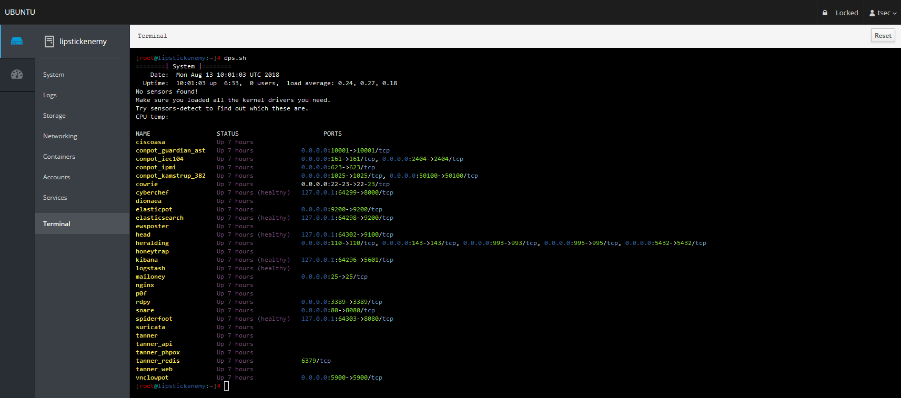
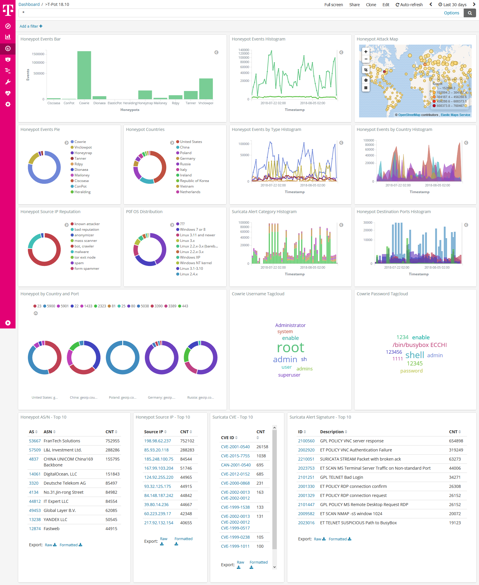
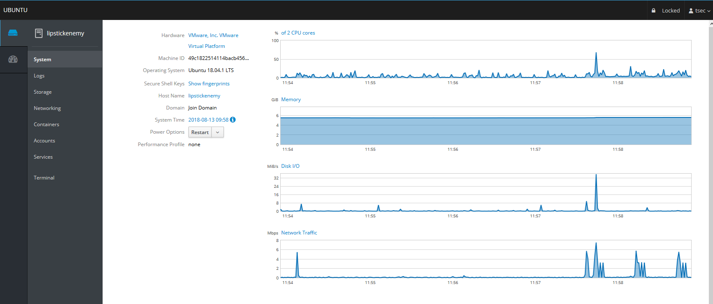
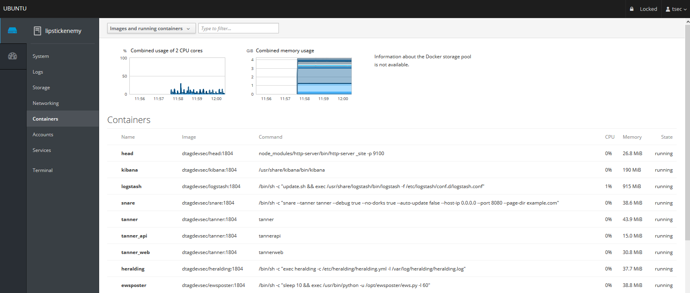
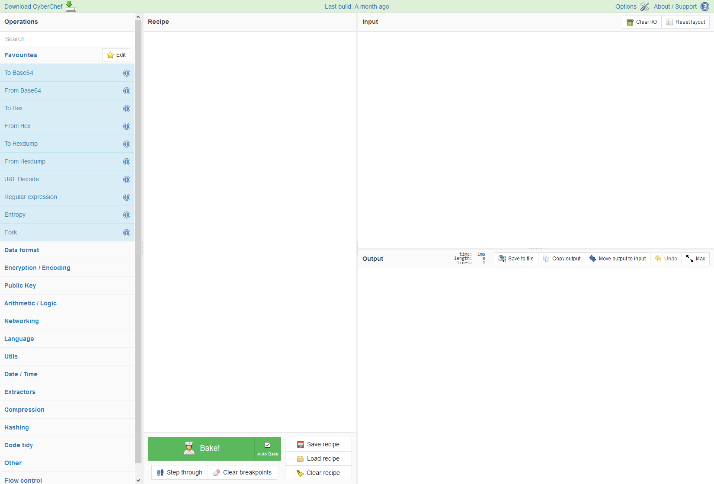
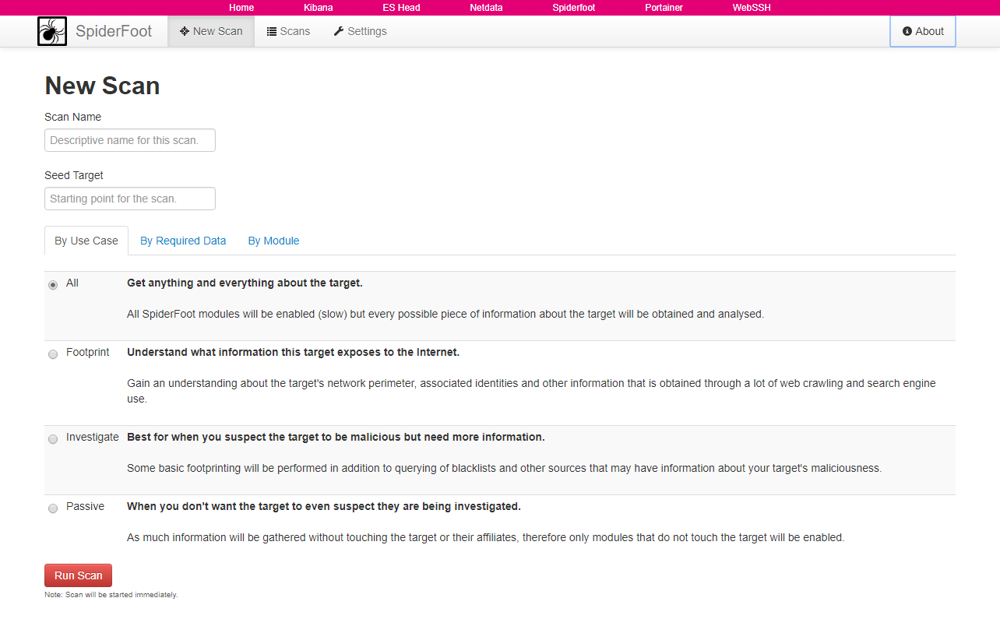

T-Pot 20.06 runs on Debian (Stable), is based heavily on

[docker](https://www.docker.com/), [docker-compose](https://docs.docker.com/compose/)

and includes dockerized versions of the following honeypots

* [adbhoney](https://github.com/huuck/ADBHoney),
* [ciscoasa](https://github.com/Cymmetria/ciscoasa_honeypot),
* [citrixhoneypot](https://github.com/MalwareTech/CitrixHoneypot),
* [conpot](http://conpot.org/),
* [cowrie](https://github.com/cowrie/cowrie),
* [dicompot](https://github.com/nsmfoo/dicompot),
* [dionaea](https://github.com/DinoTools/dionaea),
* [elasticpot](https://gitlab.com/bontchev/elasticpot),
* [glutton](https://github.com/mushorg/glutton),
* [heralding](https://github.com/johnnykv/heralding),
* [honeypy](https://github.com/foospidy/HoneyPy),
* [honeysap](https://github.com/SecureAuthCorp/HoneySAP),
* [honeytrap](https://github.com/armedpot/honeytrap/),
* [ipphoney](https://gitlab.com/bontchev/ipphoney),
* [mailoney](https://github.com/awhitehatter/mailoney),
* [medpot](https://github.com/schmalle/medpot),
* [rdpy](https://github.com/citronneur/rdpy),
* [snare](http://mushmush.org/),
* [tanner](http://mushmush.org/)


Furthermore T-Pot includes the following tools

* [Cockpit](https://cockpit-project.org/running) for a lightweight, webui for docker, os, real-time performance monitoring and web terminal.
* [Cyberchef](https://gchq.github.io/CyberChef/) a web app for encryption, encoding, compression and data analysis.
* [ELK stack](https://www.elastic.co/videos) to beautifully visualize all the events captured by T-Pot.
* [Elasticsearch Head](https://mobz.github.io/elasticsearch-head/) a web front end for browsing and interacting with an Elastic Search cluster.
* [Fatt](https://github.com/0x4D31/fatt) a pyshark based script for extracting network metadata and fingerprints from pcap files and live network traffic.
* [Spiderfoot](https://github.com/smicallef/spiderfoot) a open source intelligence automation tool.
* [Suricata](http://suricata-ids.org/) a Network Security Monitoring engine.


# TL;DR
1. Meet the [system requirements](#requirements). The T-Pot installation needs at least 8 GB RAM and 128 GB free disk space as well as a working (outgoing non-filtered) internet connection.
2. Download the T-Pot ISO from [GitHub](https://github.com/telekom-security/tpotce/releases) or [create it yourself](#createiso).
3. Install the system in a [VM](#vm) or on [physical hardware](#hw) with [internet access](#placement).
4. Enjoy your favorite beverage - [watch](https://sicherheitstacho.eu) and [analyze](#kibana).


# Table of Contents
- [Technical Concept](#concept)
- [System Requirements](#requirements)
- [Installation Types](#types)
- [Installation](#installation)
  - [Prebuilt ISO Image](#prebuilt)
  - [Create your own ISO Image](#createiso)
  - [Running in a VM](#vm)
  - [Running on Hardware](#hardware)
  - [Post Install User](#postinstall)
  - [Post Install Auto](#postinstallauto)
  - [Cloud Deployments](#cloud)
    - [Ansible](#ansible)
    - [Terraform](#terraform)
  - [First Run](#firstrun)
  - [System Placement](#placement)
- [Updates](#updates)
- [Options](#options)
  - [SSH and web access](#ssh)
  - [T-Pot Landing Page](#heimdall)
  - [Kibana Dashboard](#kibana)
  - [Tools](#tools)
  - [Maintenance](#maintenance)
  - [Community Data Submission](#submission)
  - [Opt-In HPFEEDS Data Submission](#hpfeeds-optin)
- [Roadmap](#roadmap)
- [Disclaimer](#disclaimer)
- [FAQ](#faq)
- [Contact](#contact)
- [Licenses](#licenses)
- [Credits](#credits)
- [Stay tuned](#staytuned)
- [Testimonial](#testimonial)

<a name="concept"></a>
# Technical Concept

T-Pot is based on the Debian (Stable) network installer.
The honeypot daemons as well as other support components are [dockered](http://docker.io).
This allows T-Pot to run multiple honeypot daemons and tools on the same network interface while maintaining a small footprint and constrain each honeypot within its own environment.

In T-Pot we combine the dockerized honeypots ...
* [adbhoney](https://github.com/huuck/ADBHoney),
* [ciscoasa](https://github.com/Cymmetria/ciscoasa_honeypot),
* [citrixhoneypot](https://github.com/MalwareTech/CitrixHoneypot),
* [conpot](http://conpot.org/),
* [cowrie](http://www.micheloosterhof.com/cowrie/),
* [dicompot](https://github.com/nsmfoo/dicompot),
* [dionaea](https://github.com/DinoTools/dionaea),
* [elasticpot](https://gitlab.com/bontchev/elasticpot),
* [glutton](https://github.com/mushorg/glutton),
* [heralding](https://github.com/johnnykv/heralding),
* [honeypy](https://github.com/foospidy/HoneyPy),
* [honeysap](https://github.com/SecureAuthCorp/HoneySAP),
* [honeytrap](https://github.com/armedpot/honeytrap/),
* [ipphoney](https://gitlab.com/bontchev/ipphoney),
* [mailoney](https://github.com/awhitehatter/mailoney),
* [medpot](https://github.com/schmalle/medpot),
* [rdpy](https://github.com/citronneur/rdpy),
* [snare](http://mushmush.org/),
* [tanner](http://mushmush.org/)

... with the following tools ...
* [Cockpit](https://cockpit-project.org/running) for a lightweight, webui for docker, os, real-time performance monitoring and web terminal.
* [Cyberchef](https://gchq.github.io/CyberChef/) a web app for encryption, encoding, compression and data analysis.
* [ELK stack](https://www.elastic.co/videos) to beautifully visualize all the events captured by T-Pot.
* [Elasticsearch Head](https://mobz.github.io/elasticsearch-head/) a web front end for browsing and interacting with an Elastic Search cluster.
* [Fatt](https://github.com/0x4D31/fatt) a pyshark based script for extracting network metadata and fingerprints from pcap files and live network traffic.
* [Spiderfoot](https://github.com/smicallef/spiderfoot) a open source intelligence automation tool.
* [Suricata](http://suricata-ids.org/) a Network Security Monitoring engine.

... to give you the best out-of-the-box experience possible and an easy-to-use multi-honeypot appliance.


While data within docker containers is volatile T-Pot ensures a default 30 day persistence of all relevant honeypot and tool data in the well known `/data` folder and sub-folders. The persistence configuration may be adjusted in `/opt/tpot/etc/logrotate/logrotate.conf`. Once a docker container crashes, all other data produced within its environment is erased and a fresh instance is started from the corresponding docker image.<br>

Basically, what happens when the system is booted up is the following:

- start host system
- start all the necessary services (i.e. cockpit, docker, etc.)
- start all docker containers via docker-compose (honeypots, nms, elk, etc.)

The T-Pot project provides all the tools and documentation necessary to build your own honeypot system and contribute to our [Sicherheitstacho](https://sicherheitstacho.eu).

The source code and configuration files are fully stored in the T-Pot GitHub repository. The docker images are preconfigured for the T-Pot environment. If you want to run the docker images separately, make sure you study the docker-compose configuration (`/opt/tpot/etc/tpot.yml`) and the T-Pot systemd script (`/etc/systemd/system/tpot.service`), as they provide a good starting point for implementing changes.

The individual docker configurations are located in the [docker folder](https://github.com/telekom-security/tpotce/tree/master/docker).

<a name="requirements"></a>
# System Requirements
Depending on the installation type, whether installing on [real hardware](#hardware) or in a [virtual machine](#vm), make sure the designated system meets the following requirements:

- 8 GB RAM (less RAM is possible but might introduce swapping / instabilities)
- 128 GB SSD (smaller is possible but limits the capacity of storing events)
- Network via DHCP
- A working, non-proxied, internet connection


<a name="types"></a>
# Installation Types
There are prebuilt installation types available each focussing on different aspects to get you started right out of the box. The docker-compose files are located in `/opt/tpot/etc/compose`. If you want to build your own compose file just create a new one (based on the layout and settings of the prebuilds) in `/opt/tpot/etc/compose` and run `tped.sh` afterwards to point T-Pot to the new compose file and run you personalized edition.

##### Standard
- Honeypots: adbhoney, ciscoasa, citrixhoneypot, conpot, cowrie, dicompot, dionaea, elasticpot, heralding, honeysap, honeytrap, mailoney, medpot, rdpy, snare & tanner
- Tools: cockpit, cyberchef, ELK, fatt, elasticsearch head, ewsposter, nginx / heimdall, spiderfoot, p0f & suricata


##### Sensor
- Honeypots: adbhoney, ciscoasa, citrixhoneypot, conpot, cowrie, dicompot, dionaea, elasticpot, heralding, honeypy, honeysap, honeytrap, mailoney, medpot, rdpy, snare & tanner
- Tools: cockpit, ewsposter, fatt, p0f & suricata
- Since there is no ELK stack provided the Sensor Installation only requires 4 GB of RAM.


##### Industrial
- Honeypots: conpot, cowrie, dicompot, heralding, honeysap, honeytrap, medpot & rdpy
- Tools: cockpit, cyberchef, ELK, fatt, elasticsearch head, ewsposter, nginx / heimdall, spiderfoot, p0f & suricata


##### Collector
- Honeypots: heralding & honeytrap
- Tools: cockpit, cyberchef, fatt, ELK, elasticsearch head, ewsposter, nginx / heimdall, spiderfoot, p0f & suricata


##### NextGen
- Honeypots: adbhoney, ciscoasa, citrixhoneypot, conpot, cowrie, dicompot, dionaea, glutton, heralding, honeypy, honeysap, ipphoney, mailoney, medpot, rdpy, snare & tanner
- Tools: cockpit, cyberchef, ELK, fatt, elasticsearch head, ewsposter, nginx / heimdall, spiderfoot, p0f & suricata


##### Medical
- Honeypots: dicompot & medpot
- Tools: cockpit, cyberchef, ELK, fatt, elasticsearch head, ewsposter, nginx / heimdall, spiderfoot, p0f & suricata


<a name="installation"></a>
# Installation
The installation of T-Pot is straight forward and heavily depends on a working, transparent and non-proxied up and running internet connection. Otherwise the installation **will fail!**

Firstly, decide if you want to download the prebuilt installation ISO image from [GitHub](https://github.com/telekom-security/tpotce/releases), [create it yourself](#createiso) ***or*** [post-install on an existing Debian 10 (Buster)](#postinstall).

Secondly, decide where you the system to run: [real hardware](#hardware) or in a [virtual machine](#vm)?

<a name="prebuilt"></a>
## Prebuilt ISO Image
An installation ISO image is available for download (~50MB), which is created by the [ISO Creator](https://github.com/telekom-security/tpotce) you can use yourself in order to create your own image. It will basically just save you some time downloading components and creating the ISO image.
You can download the prebuilt installation ISO from [GitHub](https://github.com/telekom-security/tpotce/releases) and jump to the [installation](#vm) section.

<a name="createiso"></a>
## Create your own ISO Image
For transparency reasons and to give you the ability to customize your install you use the [ISO Creator](https://github.com/telekom-security/tpotce) that enables you to create your own ISO installation image.

**Requirements to create the ISO image:**
- Debian 10 as host system (others *may* work, but *remain* untested)
- 4GB of free memory  
- 32GB of free storage
- A working internet connection

**How to create the ISO image:**

1. Clone the repository and enter it.
```
git clone https://github.com/telekom-security/tpotce
cd tpotce
```
2. Run the `makeiso.sh` script to build the ISO image.
The script will download and install dependencies necessary to build the image on the invoking machine. It will further download the ubuntu network installer image (~50MB) which T-Pot is based on.
```
sudo ./makeiso.sh
```
After a successful build, you will find the ISO image `tpot.iso` along with a SHA256 checksum `tpot.sha256` in your folder.

<a name="vm"></a>
## Running in VM
You may want to run T-Pot in a virtualized environment. The virtual system configuration depends on your virtualization provider.

T-Pot is successfully tested with [VirtualBox](https://www.virtualbox.org) and [VMWare](http://www.vmware.com) with just little modifications to the default machine configurations.

It is important to make sure you meet the [system requirements](#requirements) and assign virtual harddisk and RAM according to the requirements while making sure networking is bridged.

You need to enable promiscuous mode for the network interface for fatt, suricata and p0f to work properly. Make sure you enable it during configuration.

If you want to use a wifi card as a primary NIC for T-Pot, please be aware that not all network interface drivers support all wireless cards. In VirtualBox e.g. you have to choose the *"MT SERVER"* model of the NIC.

Lastly, mount the `tpot.iso` ISO to the VM and continue with the installation.<br>

You can now jump [here](#firstrun).

<a name="hardware"></a>
## Running on Hardware
If you decide to run T-Pot on dedicated hardware, just follow these steps:

1. Burn a CD from the ISO image or make a bootable USB stick using the image. <br>
Whereas most CD burning tools allow you to burn from ISO images, the procedure to create a bootable USB stick from an ISO image depends on your system. There are various Windows GUI tools available, e.g. [this tip](http://www.ubuntu.com/download/desktop/create-a-usb-stick-on-windows) might help you.<br> On [Linux](http://askubuntu.com/questions/59551/how-to-burn-a-iso-to-a-usb-device) or [MacOS](http://www.ubuntu.com/download/desktop/create-a-usb-stick-on-mac-osx) you can use the tool *dd* or create the USB stick with T-Pot's [ISO Creator](https://github.com/telekom-security).
2. Boot from the USB stick and install.

*Please note*: Limited tests are performed for the Intel NUC platform other hardware platforms **remain untested**. There is no hardware support provided of any kind.

<a name="postinstall"></a>
## Post-Install User
In some cases it is necessary to install Debian 10 (Buster) on your own:
 - Cloud provider does not offer mounting ISO images.
 - Hardware setup needs special drivers and / or kernels.
 - Within your company you have to setup special policies, software etc.
 - You just like to stay on top of things.

The T-Pot Universal Installer will upgrade the system and install all required T-Pot dependencies.

Just follow these steps:

```
git clone https://github.com/telekom-security/tpotce
cd tpotce/iso/installer/
./install.sh --type=user
```

The installer will now start and guide you through the install process.

<a name="postinstallauto"></a>
## Post-Install Auto
You can also let the installer run automatically if you provide your own `tpot.conf`. An example is available in `tpotce/iso/installer/tpot.conf.dist`. This should make things easier in case you want to automate the installation i.e. with **Ansible**.

Just follow these steps while adjusting `tpot.conf` to your needs:

```
git clone https://github.com/telekom-security/tpotce
cd tpotce/iso/installer/
cp tpot.conf.dist tpot.conf
./install.sh --type=auto --conf=tpot.conf
```

The installer will start automatically and guide you through the install process.

<a name="cloud"></a>
## Cloud Deployments
Located in the [`cloud`](cloud) folder.  
Currently there are examples with Ansible & Terraform.  
If you would like to contribute, you can add other cloud deployments like Chef or Puppet or extend current methods with other cloud providers.

*Please note*: Cloud providers usually offer adjusted Debian OS images, which might not be compatible with T-Pot. There is no cloud provider support provided of any kind.

<a name="ansible"></a>
### Ansible Deployment
You can find an [Ansible](https://www.ansible.com/) based T-Pot deployment in the [`cloud/ansible`](cloud/ansible) folder.  
The Playbook in the [`cloud/ansible/openstack`](cloud/ansible/openstack) folder is reusable for all **OpenStack** clouds out of the box.

It first creates all resources (security group, network, subnet, router), deploys a new server and then installs and configures T-Pot.

You can have a look at the Playbook and easily adapt the deploy role for other [cloud providers](https://docs.ansible.com/ansible/latest/modules/list_of_cloud_modules.html).

*Please note*: Cloud providers usually offer adjusted Debian OS images, which might not be compatible with T-Pot. There is no cloud provider support provided of any kind.

<a name="terraform"></a>
### Terraform Configuration

You can find [Terraform](https://www.terraform.io/) configuration in the [`cloud/terraform`](cloud/terraform) folder.

This can be used to launch a virtual machine, bootstrap any dependencies and install T-Pot in a single step.

Configuration for **Amazon Web Services** (AWS) and **Open Telekom Cloud** (OTC) is currently included.  
This can easily be extended to support other [Terraform providers](https://www.terraform.io/docs/providers/index.html).

*Please note*: Cloud providers usually offer adjusted Debian OS images, which might not be compatible with T-Pot. There is no cloud provider support provided of any kind.

<a name="firstrun"></a>
## First Run
The installation requires very little interaction, only a locale and keyboard setting have to be answered for the basic linux installation. While the system reboots maintain the active internet connection. The T-Pot installer will start and ask you for an installation type, password for the **tsec** user and credentials for a **web user**. Everything else will be configured automatically. All docker images and other componenents will be downloaded. Depending on your network connection and the chosen installation type, the installation may take some time. With 250Mbit down / 40Mbit up the installation is usually finished within 15-30 minutes.

Once the installation is finished, the system will automatically reboot and you will be presented with the T-Pot login screen. On the console you may login with:

- user: **[tsec or user]** *you chose during one of the post install methods*
- pass: **[password]** *you chose during the installation*

All honeypot services are preconfigured and are starting automatically.

You can login from your browser and access the Admin UI: `https://<your.ip>:64294` or via SSH to access the command line: `ssh -l tsec -p 64295 <your.ip>`

- user: **[tsec or user]** *you chose during one of the post install methods*
- pass: **[password]** *you chose during the installation*

You can also login from your browser and access the Web UI: `https://<your.ip>:64297`
- user: **[user]** *you chose during the installation*
- pass: **[password]** *you chose during the installation*


<a name="placement"></a>
# System Placement
Make sure your system is reachable through a network you suspect intruders in / from (i.e. the internet). Otherwise T-Pot will most likely not capture any attacks, other than the ones from your internal network! For starters it is recommended to put T-Pot in an unfiltered zone, where all TCP and UDP traffic is forwarded to T-Pot's network interface. However to avoid fingerprinting you can put T-Pot behind a firewall and forward all TCP / UDP traffic in the port range of 1-64000 to T-Pot while allowing access to ports > 64000 only from trusted IPs.

A list of all relevant ports is available as part of the [Technical Concept](#concept)
<br>

Basically, you can forward as many TCP ports as you want, as glutton & honeytrap dynamically bind any TCP port that is not covered by the other honeypot daemons.

In case you need external Admin UI access, forward TCP port 64294 to T-Pot, see below.
In case you need external SSH access, forward TCP port 64295 to T-Pot, see below.
In case you need external Web UI access, forward TCP port 64297 to T-Pot, see below.

T-Pot requires outgoing git, http, https connections for updates (Debian, Docker, GitHub, PyPi), attack submission (ewsposter, hpfeeds) and CVE / IP reputation translation map updates (logstash, listbot). Ports and availability may vary based on your geographical location. Also during first install outgoing ICMP / TRACEROUTE is required additionally to find the closest and fastest mirror to you.

<a name="updates"></a>
# Updates
For the ones of you who want to live on the bleeding edge of T-Pot development we introduced an update feature which will allow you to update all T-Pot relevant files to be up to date with the T-Pot master branch.
**If you made any relevant changes to the T-Pot relevant config files make sure to create a backup first.**

The Update script will:
 - **mercilessly** overwrite local changes to be in sync with the T-Pot master branch
 - upgrade the system to the packages available in Debian (Stable)
 - update all resources to be in-sync with the T-Pot master branch
 - ensure all T-Pot relevant system files will be patched / copied into the original T-Pot state
 - restore your custom ews.cfg and HPFEED settings from `/data/ews/conf`

You simply run the update script:
```
sudo su -
cd /opt/tpot/
./update.sh
```

**Despite all testing efforts please be reminded that updates sometimes may have unforeseen consequences. Please create a backup of the machine or the files with the most value to your work.**  

<a name="options"></a>
# Options
The system is designed to run without any interaction or maintenance and automatically contributes to the community.<br>
For some this may not be enough. So here some examples to further inspect the system and change configuration parameters.

<a name="ssh"></a>
## SSH and web access
By default, the SSH daemon allows access on **tcp/64295** with a user / password combination and prevents credential brute forcing attempts using `fail2ban`. This also counts for Admin UI (**tcp/64294**) and Web UI (**tcp/64297**) access.<br>

If you do not have a SSH client at hand and still want to access the machine via command line you can do so by accessing the Admin UI from `https://<your.ip>:64294`, enter

- user: **[tsec or user]** *you chose during one of the post install methods*
- pass: **[password]** *you chose during the installation*

You can also add two factor authentication to Cockpit just by running `2fa.sh` on the command line.



<a name="heimdall"></a>
## T-Pot Landing Page 
Just open a web browser and connect to `https://<your.ip>:64297`, enter

- user: **[user]** *you chose during the installation*
- pass: **[password]** *you chose during the installation*

and the **Landing Page** will automagically load. Now just click on the tool / link you want to start.


<a name="kibana"></a>
## Kibana Dashboard



<a name="tools"></a>
## Tools
The following web based tools are included to improve and ease up daily tasks.











<a name="maintenance"></a>
## Maintenance
T-Pot is designed to be low maintenance. Basically, there is nothing you have to do but let it run.

If you run into any problems, a reboot may fix it :bowtie:

If new versions of the components involved appear new docker images will be created and distributed. New images will be available from docker hub and downloaded automatically to T-Pot and activated accordingly.  

<a name="submission"></a>
## Community Data Submission
T-Pot is provided in order to make it accessible to all interested in honeypots. By default, the captured data is submitted to a community backend. This community backend uses the data to feed [Sicherheitstacho](https://sicherheitstacho.eu).
You may opt out of the submission by removing the `# Ewsposter service` from `/opt/tpot/etc/tpot.yml`:
1. Stop T-Pot services: `systemctl stop tpot`
2. Remove Ewsposter service: `vi /opt/tpot/etc/tpot.yml`
3. Remove the following lines, save and exit vi (`:x!`):<br>
```
# Ewsposter service
  ewsposter:
    container_name: ewsposter
    restart: always
    networks:
     - ewsposter_local
    image: "ghcr.io/telekom-security/ewsposter:2006"
    volumes:
     - /data:/data
     - /data/ews/conf/ews.ip:/opt/ewsposter/ews.ip
```
4. Start T-Pot services: `systemctl start tpot`

Data is submitted in a structured ews-format, a XML stucture. Hence, you can parse out the information that is relevant to you.

It is encouraged not to disable the data submission as it is the main purpose of the community approach - as you all know **sharing is caring** 😍

<a name="hpfeeds-optin"></a>
## Opt-In HPFEEDS Data Submission
As an Opt-In it is now possible to also share T-Pot data with 3rd party HPFEEDS brokers.  
If you want to share your T-Pot data you simply have to register an account with a 3rd party broker with its own benefits towards the community. You simply run `hpfeeds_optin.sh` which will ask for your credentials. It will automatically update `/opt/tpot/etc/tpot.yml` to deliver events to your desired broker.

The script can accept a config file as an argument, e.g. `./hpfeeds_optin.sh --conf=hpfeeds.cfg`

Your current config will also be stored in `/data/ews/conf/hpfeeds.cfg` where you can review or change it.  
Be sure to apply any changes by running `./hpfeeds_optin.sh --conf=/data/ews/conf/hpfeeds.cfg`.  
No worries: Your old config gets backed up in `/data/ews/conf/hpfeeds.cfg.old`

Of course you can also rerun the `hpfeeds_optin.sh` script to change and apply your settings interactively.

<a name="roadmap"></a>
# Roadmap
As with every development there is always room for improvements ...

Some features may be provided with updated docker images, others may require some hands on from your side.

You are always invited to participate in development on our [GitHub](https://github.com/telekom-security/tpotce) page.

<a name="disclaimer"></a>
# Disclaimer
- We don't have access to your system. So we cannot remote-assist when you break your configuration. But you can simply reinstall.
- The software was designed with best effort security, not to be in stealth mode. Because then, we probably would not be able to provide those kind of honeypot services.
- You install and you run within your responsibility. Choose your deployment wisely as a system compromise can never be ruled out.
- Honeypots - by design - should not host any sensitive data. Make sure you don't add any.
- By default, your data is submitted to [SecurityMeter](https://www.sicherheitstacho.eu/start/main). You can disable this in the config. But hey, wouldn't it be better to contribute to the community?

<a name="faq"></a>
# FAQ
Please report any issues or questions on our [GitHub issue list](https://github.com/telekom-security/tpotce/issues), so the community can participate.

<a name="contact"></a>
# Contact
The software is provided **as is** in a Community Edition format. T-Pot is designed to run out of the box and with zero maintenance involved. <br>
We hope you understand that we cannot provide support on an individual basis. We will try to address questions, bugs and problems on our [GitHub issue list](https://github.com/telekom-security/tpotce/issues).

<a name="licenses"></a>
# Licenses
The software that T-Pot is built on uses the following licenses.
<br>GPLv2: [conpot](https://github.com/mushorg/conpot/blob/master/LICENSE.txt), [dionaea](https://github.com/DinoTools/dionaea/blob/master/LICENSE), [honeysap](https://github.com/SecureAuthCorp/HoneySAP/blob/master/COPYING), [honeypy](https://github.com/foospidy/HoneyPy/blob/master/LICENSE), [honeytrap](https://github.com/armedpot/honeytrap/blob/master/LICENSE), [suricata](http://suricata-ids.org/about/open-source/)
<br>GPLv3: [adbhoney](https://github.com/huuck/ADBHoney), [elasticpot](https://gitlab.com/bontchev/elasticpot/-/blob/master/LICENSE), [ewsposter](https://github.com/telekom-security/ews/), [fatt](https://github.com/0x4D31/fatt/blob/master/LICENSE), [rdpy](https://github.com/citronneur/rdpy/blob/master/LICENSE), [heralding](https://github.com/johnnykv/heralding/blob/master/LICENSE.txt), [ipphoney](https://gitlab.com/bontchev/ipphoney/-/blob/master/LICENSE), [snare](https://github.com/mushorg/snare/blob/master/LICENSE), [tanner](https://github.com/mushorg/snare/blob/master/LICENSE)
<br>Apache 2 License: [cyberchef](https://github.com/gchq/CyberChef/blob/master/LICENSE), [dicompot](https://github.com/nsmfoo/dicompot/blob/master/LICENSE), [elasticsearch](https://github.com/elasticsearch/elasticsearch/blob/master/LICENSE.txt), [logstash](https://github.com/elasticsearch/logstash/blob/master/LICENSE), [kibana](https://github.com/elasticsearch/kibana/blob/master/LICENSE.md), [docker](https://github.com/docker/docker/blob/master/LICENSE), [elasticsearch-head](https://github.com/mobz/elasticsearch-head/blob/master/LICENCE)
<br>MIT license: [ciscoasa](https://github.com/Cymmetria/ciscoasa_honeypot/blob/master/LICENSE), [glutton](https://github.com/mushorg/glutton/blob/master/LICENSE)
<br> Other: [citrixhoneypot](https://github.com/MalwareTech/CitrixHoneypot#licencing-agreement-malwaretech-public-licence), [cowrie](https://github.com/micheloosterhof/cowrie/blob/master/LICENSE.md), [mailoney](https://github.com/awhitehatter/mailoney), [Debian licensing](https://www.debian.org/legal/licenses/)

<a name="credits"></a>
# Credits
Without open source and the fruitful development community (we are proud to be a part of), T-Pot would not have been possible! Our thanks are extended but not limited to the following people and organizations:

### The developers and development communities of

* [adbhoney](https://github.com/huuck/ADBHoney/graphs/contributors)
* [apt-fast](https://github.com/ilikenwf/apt-fast/graphs/contributors)
* [ciscoasa](https://github.com/Cymmetria/ciscoasa_honeypot/graphs/contributors)
* [citrixhoneypot](https://github.com/MalwareTech/CitrixHoneypot/graphs/contributors)
* [cockpit](https://github.com/cockpit-project/cockpit/graphs/contributors)
* [conpot](https://github.com/mushorg/conpot/graphs/contributors)
* [cowrie](https://github.com/micheloosterhof/cowrie/graphs/contributors)
* [debian](http://www.debian.org/)
* [dicompot](https://github.com/nsmfoo/dicompot/graphs/contributors)
* [dionaea](https://github.com/DinoTools/dionaea/graphs/contributors)
* [docker](https://github.com/docker/docker/graphs/contributors)
* [elasticpot](https://gitlab.com/bontchev/elasticpot/-/project_members)
* [elasticsearch](https://github.com/elastic/elasticsearch/graphs/contributors)
* [elasticsearch-head](https://github.com/mobz/elasticsearch-head/graphs/contributors)
* [ewsposter](https://github.com/armedpot/ewsposter/graphs/contributors)
* [fatt](https://github.com/0x4D31/fatt/graphs/contributors)
* [glutton](https://github.com/mushorg/glutton/graphs/contributors)
* [heralding](https://github.com/johnnykv/heralding/graphs/contributors)
* [honeypy](https://github.com/foospidy/HoneyPy/graphs/contributors)
* [honeysap](https://github.com/SecureAuthCorp/HoneySAP/graphs/contributors)
* [honeytrap](https://github.com/armedpot/honeytrap/graphs/contributors)
* [ipphoney](https://gitlab.com/bontchev/ipphoney/-/project_members)
* [kibana](https://github.com/elastic/kibana/graphs/contributors)
* [logstash](https://github.com/elastic/logstash/graphs/contributors)
* [mailoney](https://github.com/awhitehatter/mailoney)
* [medpot](https://github.com/schmalle/medpot/graphs/contributors)
* [p0f](http://lcamtuf.coredump.cx/p0f3/)
* [rdpy](https://github.com/citronneur/rdpy)
* [spiderfoot](https://github.com/smicallef/spiderfoot)
* [snare](https://github.com/mushorg/snare/graphs/contributors)
* [tanner](https://github.com/mushorg/tanner/graphs/contributors)
* [suricata](https://github.com/inliniac/suricata/graphs/contributors)

### The following companies and organizations
* [debian](https://www.debian.org/)
* [docker](https://www.docker.com/)
* [elastic.io](https://www.elastic.co/)
* [honeynet project](https://www.honeynet.org/)
* [intel](http://www.intel.com)

### ... and of course ***you*** for joining the community!

<a name="staytuned"></a>
# Stay tuned ...
A new version of T-Pot is released about every 6-12 months, development has shifted more and more towards rolling releases and the usage of `/opt/tpot/update.sh`.

<a name="testimonial"></a>
# Testimonials
One of the greatest feedback we have gotten so far is by one of the Conpot developers:<br>
***"[...] I highly recommend T-Pot which is ... it's not exactly a swiss army knife .. it's more like a swiss army soldier, equipped with a swiss army knife. Inside a tank. A swiss tank. [...]"***<br>
And from @robcowart (creator of [ElastiFlow](https://github.com/robcowart/elastiflow)):<br>
***"#TPot is one of the most well put together turnkey honeypot solutions. It is a must-have for anyone wanting to analyze and understand the behavior of malicious actors and the threat they pose to your organization."***
