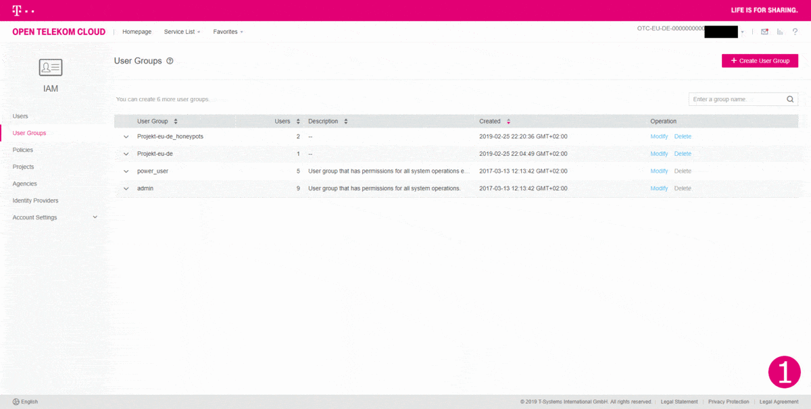
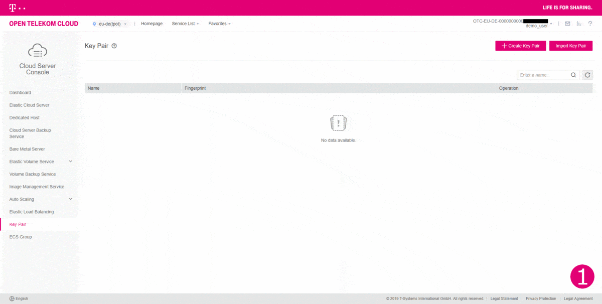

# T-Pot Ansible

Here you can find a ready-to-use solution for your automated T-Pot deployment using [Ansible](https://www.ansible.com/).  
It consists of an Ansible Playbook with multiple roles, which is reusable for all [OpenStack](https://www.openstack.org/) based clouds (e.g. Open Telekom Cloud, Orange Cloud, Telefonica Open Cloud, OVH) out of the box.  
Apart from that you can easily adapt the deploy role to use other [cloud providers](https://docs.ansible.com/ansible/latest/modules/list_of_cloud_modules.html) (e.g. AWS, Azure, Digital Ocean, Google).

The Playbook first creates all resources (security group, network, subnet, router), deploys a new server and then installs and configures T-Pot.

This example showcases the deployment on our own OpenStack based Public Cloud Offering [Open Telekom Cloud](https://open-telekom-cloud.com/en).

# Table of contents
- [Preparation of Ansible Master](#ansible-master)
  - [Ansible Installation](#ansible)
  - [Agent Forwarding](#agent-forwarding)
- [Preparations in Open Telekom Cloud Console](#preparation)
  - [Create new project](#project)
  - [Create API user](#api-user)
  - [Import Key Pair](#key-pair)
- [Clone Git Repository](#clone-git)
- [Settings and recommended values](#settings)
  - [Clouds.yaml](#clouds-yaml)
  - [Ansible remote user](#remote-user)
  - [Instance settings](#instance-settings)
  - [User password](#user-password)
  - [Configure `tpot.conf.dist`](#tpot-conf)
  - [Optional: Custom `ews.cfg`](#ews-cfg)
  - [Optional: Custom HPFEEDS](#hpfeeds)
- [Deploying a T-Pot](#deploy)
- [Further documentation](#documentation)

<a name="ansible-master"></a>
# Preparation of Ansible Master
You can either run the Ansible Playbook locally on your Linux or macOS machine or you can use an ECS (Elastic Cloud Server) on Open Telekom Cloud, which I did.  
I used Ubuntu 18.04 for my Ansible Master Server, but other OSes are fine too.  
Ansible works over the SSH Port, so you don't have to add any special rules to your Security Group.

<a name="ansible"></a>
## Ansible Installation
Example for Ubuntu 18.04:  

At first we update the system:  
`sudo apt update`  
`sudo apt dist-upgrade`

Then we need to add the repository and install Ansible:  
`sudo apt-add-repository --yes --update ppa:ansible/ansible`  
`sudo apt install ansible`

For other OSes and Distros have a look at the official [Ansible Documentation](https://docs.ansible.com/ansible/latest/installation_guide/intro_installation.html).

<a name="agent-forwarding"></a>
## Agent Forwarding
If you run the Ansible Playbook remotely on your Ansible Master Server, Agent Forwarding must be enabled in order to let Ansible connect to newly created machines.  
- On Linux or macOS:  
  - Create or edit `~/.ssh/config`
    ```
    Host ANSIBLE_MASTER_IP
    ForwardAgent yes
    ```
- On Windows using Putty:  


<a name="preparation"></a>
# Preparations in Open Telekom Cloud Console
(You can skip this if you have already set up a project and an API account with key pair)  
(Just make sure you know the naming for everything, as you need to configure the Ansible variables.)

Before we can start deploying, we have to prepare the Open Telekom Cloud tenant.  
For that, go to the [Web Console](https://auth.otc.t-systems.com/authui/login) and log in with an admin user.

<a name="project"></a>
## Create new project
I strongly advise you to create a separate project for the T-Pots in your tenant.  
In my case I named it `tpot`.


<a name="api-user"></a>
## Create API user
The next step is to create a new user account, which is restricted to the project.  
This ensures that the API access is limited to that project.



<a name="key-pair"></a>
## Import Key Pair
:warning: Now log in with the newly created API user account and select your project.


Import your SSH public key.




<a name="clone-git"></a>
# Clone Git Repository
Clone the `tpotce` repository to your Ansible Master:  
`git clone https://github.com/dtag-dev-sec/tpotce.git`  
All Ansible related files are located in the [`cloud/ansible/openstack`](openstack) folder.

<a name="settings"></a>
# Settings and recommended values
You can configure all aspects of your Elastic Cloud Server and T-Pot before using the Playbook:

<a name="clouds-yaml"></a>
## Clouds.yaml
Located at [`openstack/clouds.yaml`](openstack/clouds.yaml).  
Enter your Open Telekom Cloud API user credentials here (username, password, project name, user domain name):  
```
clouds:
  open-telekom-cloud:
    profile: otc
    auth:
      project_name: eu-de_your_project
      username: your_api_user
      password: your_password
      user_domain_name: OTC-EU-DE-000000000010000XXXXX
```
You can also perform different authentication methods like sourcing OpenStack OS_* environment variables or providing an inline dictionary.  
For more information have a look in the [os_server](https://docs.ansible.com/ansible/latest/modules/os_server_module.html) Ansible module documentation.

<a name="remote-user"></a>
## Ansible remote user
You may have to adjust the `remote_user` in the Ansible Playbook under [`openstack/deploy_tpot.yaml`](openstack/deploy_tpot.yaml) depending on your Debian base image (e.g. on Open Telekom Cloud the default Debian user is `linux`).

<a name="instance-settings"></a>
## Instance settings
Located at [`openstack/roles/deploy/vars/main.yaml`](openstack/roles/deploy/vars/main.yaml).  
Here you can customize your virtual machine specifications:
  - Choose an availability zone. For Open Telekom Cloud reference see [here](https://docs.otc.t-systems.com/en-us/endpoint/index.html).
  - Change the OS image (For T-Pot we need Debian)
  - (Optional) Change the volume size
  - Specify your key pair (:warning: Mandatory)
  - (Optional) Change the instance type (flavor)  
    `s2.medium.8` corresponds to 1 vCPU and 8GB of RAM and is the minimum required flavor.  
    A full list of Open Telekom Cloud flavors can be found [here](https://docs.otc.t-systems.com/en-us/usermanual/ecs/en-us_topic_0177512565.html).

```
availability_zone: eu-de-03
image: Standard_Debian_10_latest
volume_size: 128
key_name: your-KeyPair
flavor: s2.medium.8
```

<a name="user-password"></a>
## User password
Located at [`openstack/roles/install/vars/main.yaml`](openstack/roles/install/vars/main.yaml).  
Here you can set the password for your Debian user (**you should definitely change that**).
```
user_password: LiNuXuSeRPaSs#
```

<a name="tpot-conf"></a>
## Configure `tpot.conf.dist`
The file is located in [`iso/installer/tpot.conf.dist`](/iso/installer/tpot.conf.dist).  
Here you can choose:
  - between the various T-Pot editions
  - a username for the web interface
  - a password for the web interface (**you should definitely change that**)

```
# tpot configuration file
# myCONF_TPOT_FLAVOR=[STANDARD, SENSOR, INDUSTRIAL, COLLECTOR, NEXTGEN]
myCONF_TPOT_FLAVOR='STANDARD'
myCONF_WEB_USER='webuser'
myCONF_WEB_PW='w3b$ecret'
```

<a name="ews-cfg"></a>
## Optional: Custom `ews.cfg`
Enable this by uncommenting the role in the [deploy_tpot.yaml](openstack/deploy_tpot.yaml) playbook.
```
#    - custom_ews
```

You can use a custom config file for `ewsposter`.  
e.g. when you have your own credentials for delivering data to our [Sicherheitstacho](https://sicherheitstacho.eu/start/main).  
You can find the `ews.cfg` template file here: [`openstack/roles/custom_ews/templates/ews.cfg`](openstack/roles/custom_ews/templates/ews.cfg) and adapt it for your needs.

For setting custom credentials, these settings would be relevant for you (the rest of the file can stay as is):  
```
[MAIN]
...
contact = your_email_address
...

[EWS]
...
username = your_username
token = your_token
...
```

<a name="hpfeeds"></a>
## Optional: Custom HPFEEDS
Enable this by uncommenting the role in the [deploy_tpot.yaml](openstack/deploy_tpot.yaml) playbook.
```
#    - custom_hpfeeds
```

You can specify custom HPFEEDS in [`openstack/roles/custom_hpfeeds/templates/hpfeeds.cfg`](openstack/roles/custom_hpfeeds/templates/hpfeeds.cfg).  
That file contains the defaults (turned off) and you can adapt it for your needs, e.g. for SISSDEN:
```
myENABLE=true
myHOST=hpfeeds.sissden.eu
myPORT=10000
myCHANNEL=t-pot.events
myCERT=/opt/ewsposter/sissden.pem
myIDENT=your_user
mySECRET=your_secret
myFORMAT=json
```

<a name="deploy"></a>
# Deploying a T-Pot :honey_pot::honeybee:
Now, after configuring everything, we can finally start deploying T-Pots!  
Go to the [`openstack`](openstack) folder and run the Ansible Playbook with:  
`ansible-playbook deploy_tpot.yaml`  
(Yes, it is as easy as that :smile:)

If you are running on a machine which asks for a sudo password, you can use:  
`ansible-playbook --ask-become-pass deploy_tpot.yaml`

The Playbook will first install required packages on the Ansible Master and then deploy a new server instance.  
After that, T-Pot gets installed and configured on the newly created host, optionally custom configs are applied and finally it reboots.

Once this is done, you can proceed with connecting/logging in to the T-Pot according to the [documentation](https://github.com/dtag-dev-sec/tpotce#ssh-and-web-access).

<a name="documentation"></a>
# Further documentation
- [Ansible Documentation](https://docs.ansible.com/ansible/latest/)
- [Cloud modules — Ansible Documentation](https://docs.ansible.com/ansible/latest/modules/list_of_cloud_modules.html)
- [os_server – Create/Delete Compute Instances from OpenStack — Ansible Documentation](https://docs.ansible.com/ansible/latest/modules/os_server_module.html)
- [Open Telekom Cloud Help Center](https://docs.otc.t-systems.com/)
- [Open Telekom Cloud API Overview](https://docs.otc.t-systems.com/en-us/api/wp/en-us_topic_0052070394.html)
