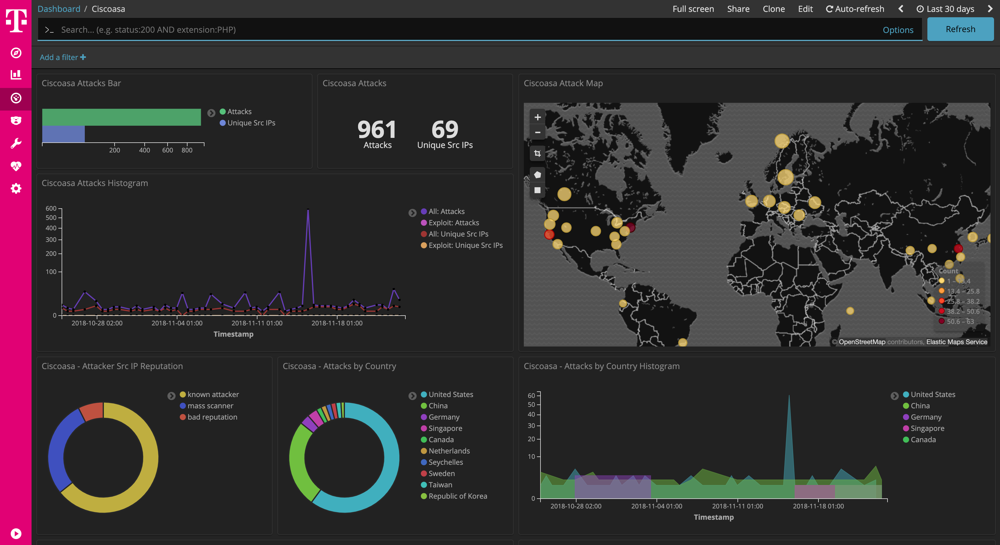

 

# ciscoasa

[Ciscoasa](https://github.com/cymmetria/ciscoasa_honeypot) is a low interaction honeypot for the Cisco ASA component capable of detecting CVE-2018-0101, a DoS and remote code execution vulnerability

This dockerized version is part of the **[T-Pot community honeypot](http://dtag-dev-sec.github.io/)** of Deutsche Telekom AG.

The `Dockerfile` contains the blueprint for the dockerized ciscoasa and will be used to setup the docker image.

The `docker-compose.yml` contains the necessary settings to test conpot using `docker-compose`. This will ensure to start the docker container with the appropriate permissions and port mappings.

# Ciscoasa Dashboard

