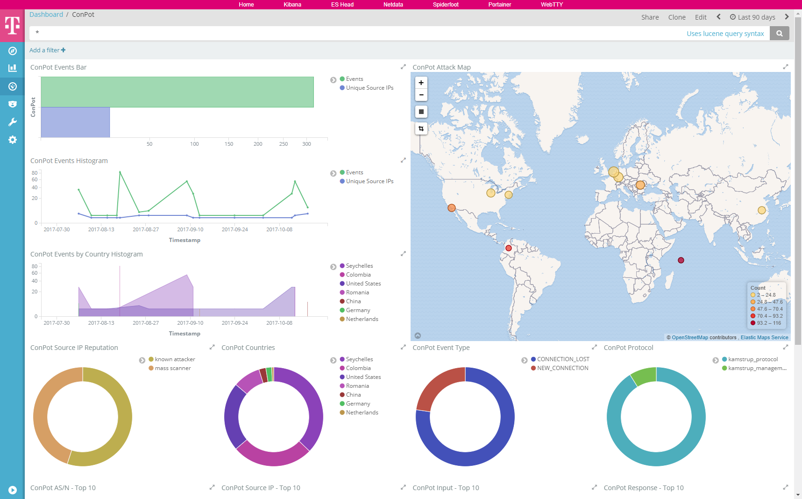

 

# conpot

[ConPot](http://conpot.org/) is a low interactive server side Industrial Control Systems honeypot designed to be easy to deploy, modify and extend. By providing a range of common industrial control protocols we created the basics to build your own system, capable to emulate complex infrastructures to convince an adversary that he just found a huge industrial complex. To improve the deceptive capabilities, we also provided the possibility to server a custom human machine interface to increase the honeypots attack surface. The response times of the services can be artificially delayed to mimic the behavior of a system under constant load. Because we are providing complete stacks of the protocols, Conpot can be accessed with productive HMI's or extended with real hardware. Conpot is developed under the umbrella of the [Honeynet Project](https://www.honeynet.org/) and on the shoulders of a couple of very big giants.

This dockerized version is part of the **[T-Pot community honeypot](http://dtag-dev-sec.github.io/)** of Deutsche Telekom AG.

The `Dockerfile` contains the blueprint for the dockerized conpot and will be used to setup the docker image.

The `docker-compose.yml` contains the necessary settings to test conpot using `docker-compose`. This will ensure to start the docker container with the appropriate permissions and port mappings.

# ConPot Dashboard

