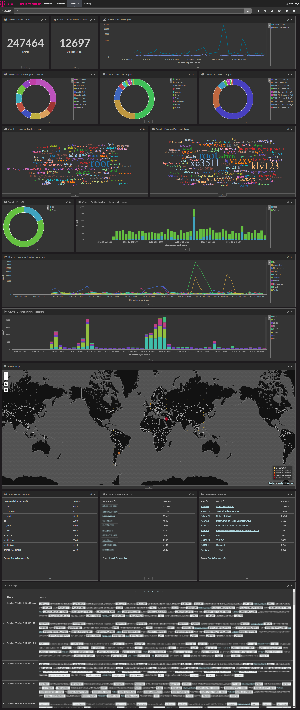

 

# cowrie

[cowrie](http://www.micheloosterhof.com/cowrie/) is an extended fork of the medium interaction honeypot [kippo](https://github.com/desaster/kippo).

This dockerized version is part of the **[T-Pot community honeypot](http://dtag-dev-sec.github.io/)** of Deutsche Telekom AG.

The `Dockerfile` contains the blueprint for the dockerized cowrie and will be used to setup the docker image.  

The `docker-compose.yml` contains the necessary settings to test cowrie using `docker-compose`. This will ensure to start the docker container with the appropriate permissions and port mappings.

# Cowrie Dashboard

