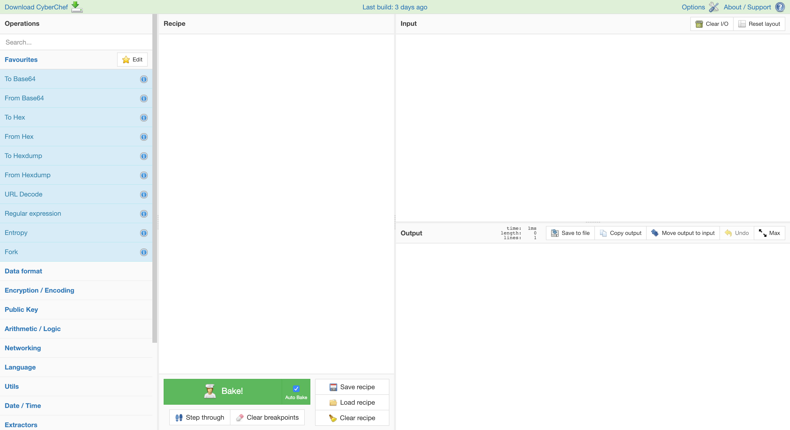

 

# cyberchef

[cyberchef](https://github.com/gchq/CyberChef) The Cyber Swiss Army Knife - a web app for encryption, encoding, compression and data analysis.

This dockerized version is part of the **[T-Pot community honeypot](http://dtag-dev-sec.github.io/)** of Deutsche Telekom AG.

The `Dockerfile` contains the blueprint for the dockerized version and will be used to setup the docker image.

The `docker-compose.yml` contains the necessary settings to test cyberchef using `docker-compose`. This will ensure to start the docker container with the appropriate permissions and port mappings.

# CyberChef UI

