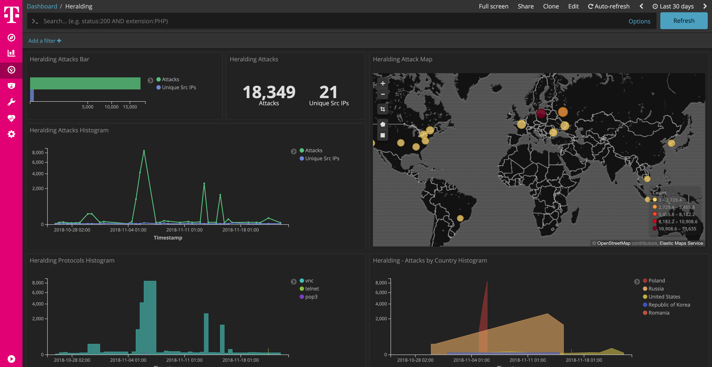

 

# heralding

[Heralding](https://github.com/johnnykv/heralding) is a simple honeypot that collects credentials, nothing more. Heralding is that honeypot! Currently the following protocols are supported: ftp, telnet, ssh, http, https, pop3, pop3s, imap, imaps, smtp and postgresql.

This dockerized version is part of the **[T-Pot community honeypot](http://dtag-dev-sec.github.io/)** of Deutsche Telekom AG.

The `Dockerfile` contains the blueprint for the dockerized heralding and will be used to setup the docker image.

The `docker-compose.yml` contains the necessary settings to test conpot using `docker-compose`. This will ensure to start the docker container with the appropriate permissions and port mappings.

# heralding Dashboard

