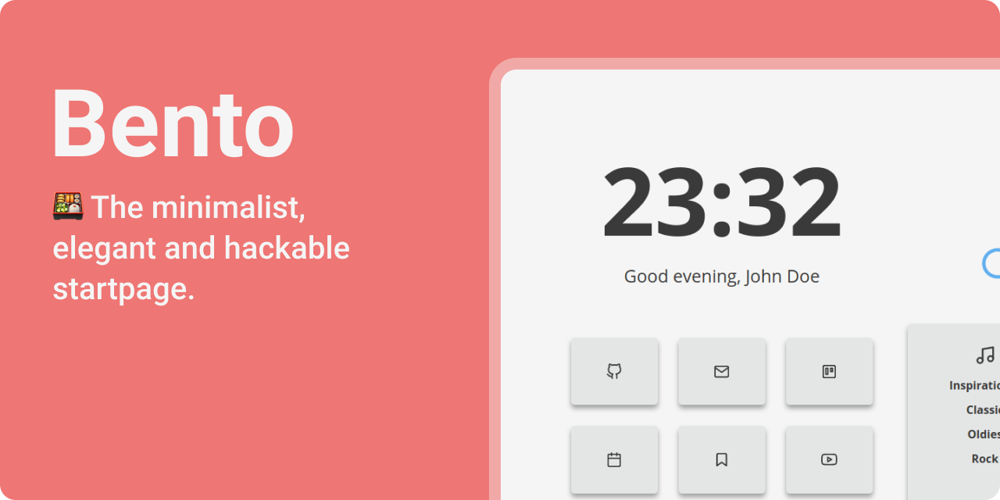
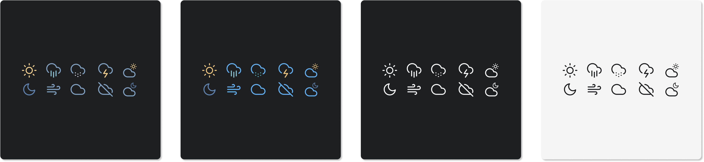
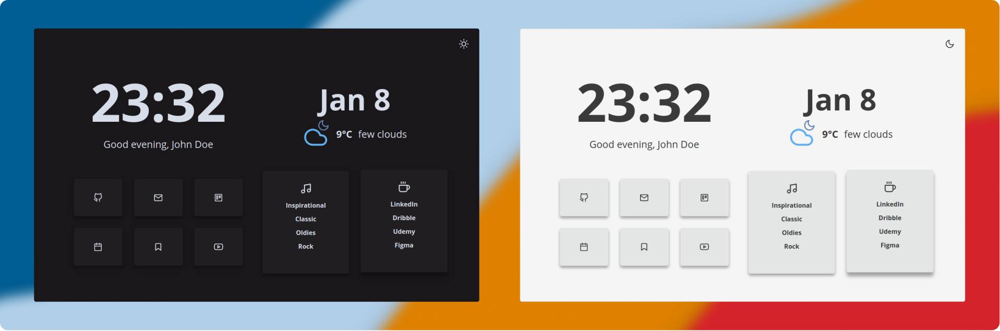

<p style="margin: -20px 0 30px">
  <a href="https://www.buymeacoffee.com/migueravila" target="_blank" style='margin-right:0px; margin-top:5px'>
    
  </a>

  <a href="https://migueravila.github.io/Bento/" target="_blank" style='margin-right:0px; margin-top:5px'>
    
  </a> 
</p>

<br />

## 👇 Índice
- [👇 Índice](#-índice)
- [✨ Características](#-características)
- [🚀 Usos](#-usos)
    - [Como página de inicio](#como-página-de-inicio)
    - [Como una nueva pestaña](#como-una-nueva-pestaña)
- [🎨 Personalización](#-personalización)
  - [👋 General: Nombre, Imagen De Fondo y Saludos](#-general-nombre-imagen-de-fondo-y-saludos)
  - [🏷️ Botones de Enlace****](#️-botones-de-enlace)
  - [📑 Lista de enlaces](#-lista-de-enlaces)
  - [⛈️ Clima: Clave De La Api, Iconos y Grupos](#️-clima-clave-de-la-api-iconos-y-grupos)
  - [💛 Colores](#-colores)
  - [🌑 Cambio automatico de tema](#-cambio-automatico-de-tema)


## ✨ Características

- **Configuración Sencilla** de archivos.
- **Modo Claro/Obscuro** puedes alternarlos y se guardara en tu almacenamiento local.
- **Fecha y Hora**, puedes utilizar el formato de 24 horas (predeterminado) o el de 12 horas.
- **Saludos** fáciles de modificar.
- **Variables** para colores y tamaños de fuente personalizados en el código del archivo `style.css`.
- **Iconos** todos los iconos provienen de [Feather Icons](https://feathericons.com/) (Otros los hice yo mismo, tomando los iconos de Feather Icons como base).
- **Archivos Modulares** de JavaScript para una lectura sencilla.

## 🚀 Usos

#### Como página de inicio

1. Haz un Fork de este repositorio
2. Activa el servicio de GitHub Pages `Settings > GitHub Pages > Source [rama master] > Save`
3. Configúrala como página de inicio:
   - Haz click en el botón Menú, selecciona Opciones, selecciona Preferencias
   - Haz click en el panel de inicio.
   - Haz click en el menú al lado de Inicio y Nuevas Ventanas. Elige la opción de mostrar URL's personalizadas, después, añade el enlace de tu GitHub Pages.

#### Como una nueva pestaña

Puedes utilizar distintos Add-ons/Extensiones para ello

- Si usas Firefox: [Custom New Tab Page](https://addons.mozilla.org/en-US/firefox/addon/custom-new-tab-page/?src=search)
- Si usas Chromium (Brave, Vivaldi, Chrome): [Custom New Tab URL](https://chrome.google.com/webstore/detail/custom-new-tab-url/mmjbdbjnoablegbkcklggeknkfcjkjia)

## 🎨 Personalización

Casi todas la personalización puede ser configurada desde el archivo `config.js`:

### 👋 General: Nombre, Imagen De Fondo y Saludos

Para cambiar el nombre por defecto, los saludos y si deseas tener una imagen de fondo o abrir los enlaces en una nueva pestaña, edita las primeras configuraciones en el archivo `config.js`.

```js
 // General
  name: 'John',
  imageBackground: false,
  openInNewTab: true,

  // Saludos
  greetingMorning: 'Good morning!',
  greetingAfternoon: 'Good afternoon,',
  greetingEvening: 'Good evening,',
  greetingNight: 'Go to Sleep!',

```

> Puedes cambiar el fondo, sustituyendo el archivo `background.jpg` en la carpeta `assets`.


### 🏷️ Botones de Enlace****

Para editar los botones solo tienes que cambiar la siguiente lista en el archivo `config.js` eligiendo un enlace, un icono proveniente de [Feather Icons](https://feathericons.com/) y un nombre:

```js
cards: [
    {
      id: '1',
      name: 'Github',
      icon: 'github',
      link: 'https://github.com/',
    },
    {
      id: '2',
      name: 'Mail',
      icon: 'mail',
      link: 'https://mail.protonmail.com/',
    },
    {
      id: '3',
      name: 'Todoist',
      icon: 'trello',
      link: 'https://calendar.google.com/calendar/r',
    },
    {
      id: '4',
      name: 'Calendar',
      icon: 'calendar',
      link: 'https://calendar.google.com/calendar/r',
    },
    {
      id: '5',
      name: 'Reddit',
      icon: 'bookmark',
      link: 'https://reddit.com',
    },
    {
      id: '6',
      name: 'Odysee',
      icon: 'youtube',
      link: 'https://odysee.com/',
    },
  ],
```

### 📑 Lista de enlaces

Lo mismo pasa con la lista de enlaces, puedes cambiar la lista de iconos (también provenientes de [Feather Icons](https://feathericons.com/)) y los enlaces:

```js
  //Iconos
  firstListIcon: 'music',
  secondListIcon: 'coffee',

  // Enlaces
  lists: {
    firstList: [
      {
        name: 'Inspirational',
        link: 'https://www.youtube.com/watch?v=dQw4w9WgXcQ',
      },
      {
        name: 'Classic',
        link: 'https://www.youtube.com/watch?v=dQw4w9WgXcQ',
      },
      {
        name: 'Oldies',
        link: 'https://www.youtube.com/watch?v=dQw4w9WgXcQ',
      },
      {
        name: 'Rock',
        link: 'https://www.youtube.com/watch?v=dQw4w9WgXcQ',
      },
    ],
    secondList: [
      {
        name: 'Linkedin',
        link: 'https://linkedin.com/',
      },
      {
        name: 'Figma',
        link: 'https://figma.com/',
      },
      {
        name: 'Dribbble',
        link: 'https://dribbble.com',
      },
      {
        name: 'Telegram',
        link: 'https://webk.telegram.org',
      },
    ],
  },
```

### ⛈️ Clima: Clave De La Api, Iconos y Grupos

Para configurar el widget del clima necesitaras una clave de API proveniente de: `https://openweathermap.org/`. Una vez que hayas obtenido tu clave, necesitaras configurar tu latitud y longitud, para ello puedes usar: `https://www.latlong.net/` para obtenerlas. 

Finalmente, escoge un set de iconos:



- **Nord** Usa el esquema de colores Nord si te encantan los colores agradables a la vista.
- **OneDark** (_Predeterminado_) Usa el esquema de colores One Dark Pro.
- **Dark** Para usuarios que solo usan temas claros y quieren un look minimalista.
- **White** Para usuarios que solo usan temas oscuros y quieren un look minimalista.

Finalmente, solo añádelos al archivo `config.js`.

```js
  // clima
  weatherKey: 'InsertYourAPIKeyHere123456',
  weatherIcons: 'OneDark',
  weatherUnit: 'C',
  weatherLatitude: '37.774929',
  weatherLongitude: '-122.419418',
```

### 💛 Colores

En el archivo `app.css` puedes cambiar las variables para cualquiera de los temas (Oscuro y Claro):

```css
/* Tema Claro  */

:root {
  --accent: #61b0f1; /* Hover color */
  --bg: #f5f5f5; /* Background color */
  --sbg: #e4e6e6; /* Cards color */
  --fg: #3a3a3a; /* Foreground color */
  --sfg: #3a3a3a; /* Sceondary Foreground color */
}

/* Tema Oscuro  */

.darktheme {
  --accent: #61b0f1; /* Hover color */
  --bg: #19171a; /* Background color */
  --sbg: #201e21; /* Cards color */
  --fg: #d8dee9; /* Foreground color */
  --sfg: #3a3a3a; /* Secondary Foreground color */
}
```

### 🌑 Cambio automatico de tema

The theme can be automatically changed by the OS' current theme or personalized hours
that you can change in the `config.js` file:

```js
  // Autochange
  autoChangeTheme: true,

  // Autochabge by OS
  changeThemeByOS: false, 

  // Autochange by hour options (24hrs format, string must be in: hh:mm)
  changeThemeByHour: true, // If it's true, it will use the values below:
  hourDarkThemeActive: '18:30', // Turn on the dark theme after this hour
  hourDarkThemeInactive: '07:00', // Turn off the dark theme after this hour and before the above hour
```


