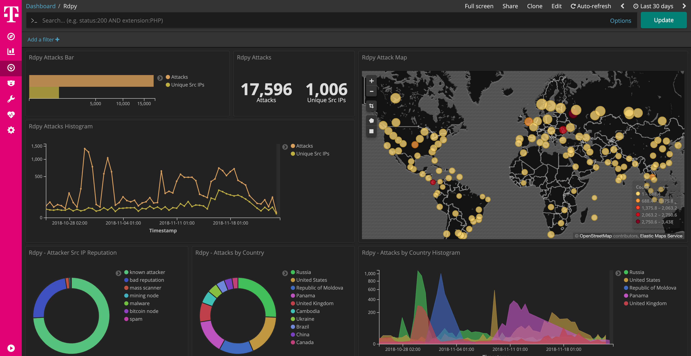

 

# rdpy

[rdpy](https://github.com/citronneur/rdpy) RDPY is a pure Python implementation of the Microsoft RDP (Remote Desktop Protocol) protocol (client and server side). RDPY is built over the event driven network engine Twisted. RDPY support standard RDP security layer, RDP over SSL and NLA authentication (through ntlmv2 authentication protocol).

This dockerized version is part of the **[T-Pot community honeypot](http://dtag-dev-sec.github.io/)** of Deutsche Telekom AG.

The `Dockerfile` contains the blueprint for the dockerized rdpy and will be used to setup the docker image.  

The `docker-compose.yml` contains the necessary settings to test rdpy using `docker-compose`. This will ensure to start the docker container with the appropriate permissions and port mappings.

# RDPY Dashboard

