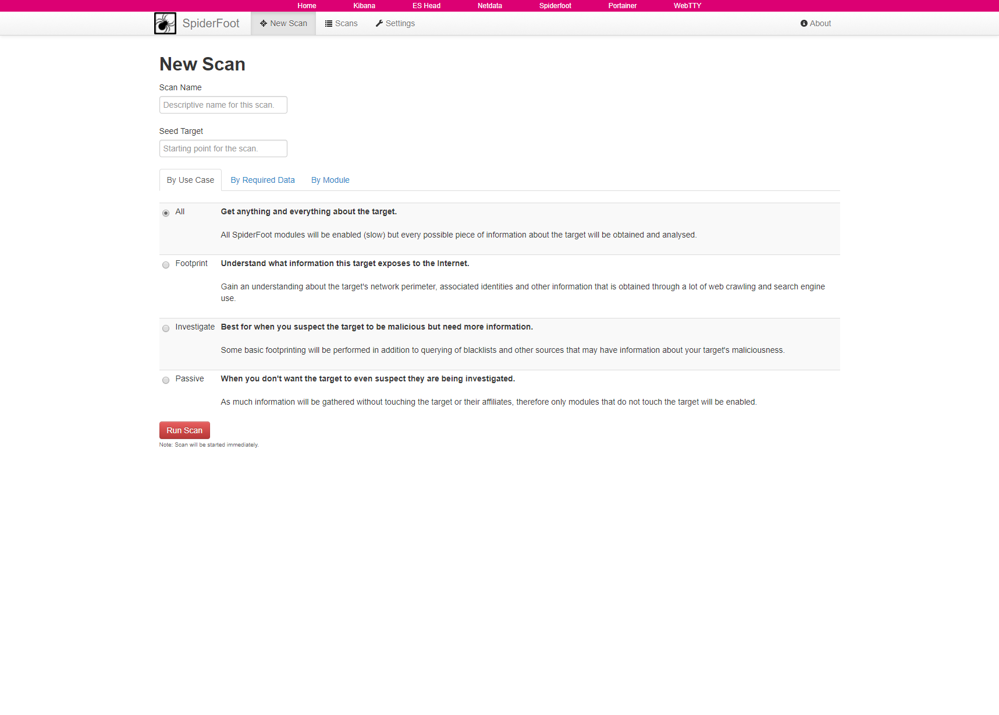

 

[spiderfoot](https://github.com/smicallef/spiderfoot) the open source footprinting and intelligence-gathering tool.

This dockerized version is part of the **[T-Pot community honeypot](http://dtag-dev-sec.github.io/)** of Deutsche Telekom AG.

The `Dockerfile` contains the blueprint for the dockerized spiderfoot and will be used to setup the docker image.

The `docker-compose.yml` contains the necessary settings to test spiderfoot using `docker-compose`. This will ensure to start the docker container with the appropriate permissions and port mappings.

# Spiderfoot UI

