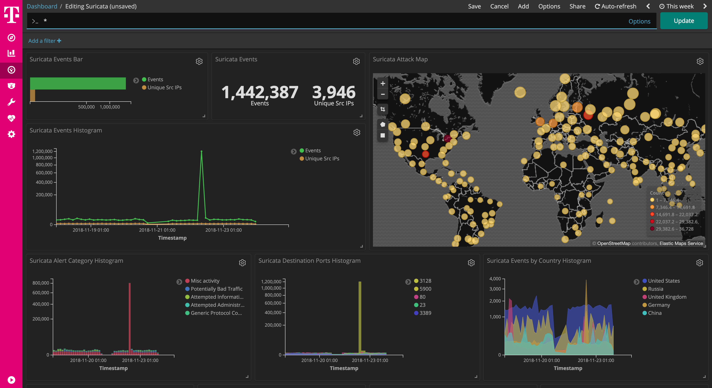

 

# dockerized suricata

[suricata](http://suricata-ids.org/) is a Network IDS, IPS and Network Security Monitoring engine.

This dockerized version is part of the **[T-Pot community honeypot](http://dtag-dev-sec.github.io/)** of Deutsche Telekom AG.

The `Dockerfile` contains the blueprint for the dockerized suricata and will be used to setup the docker image.  

The `docker-compose.yml` contains the necessary settings to test suricata using `docker-compose`. This will ensure to start the docker container with the appropriate permissions.

# Suricata Dashboard

