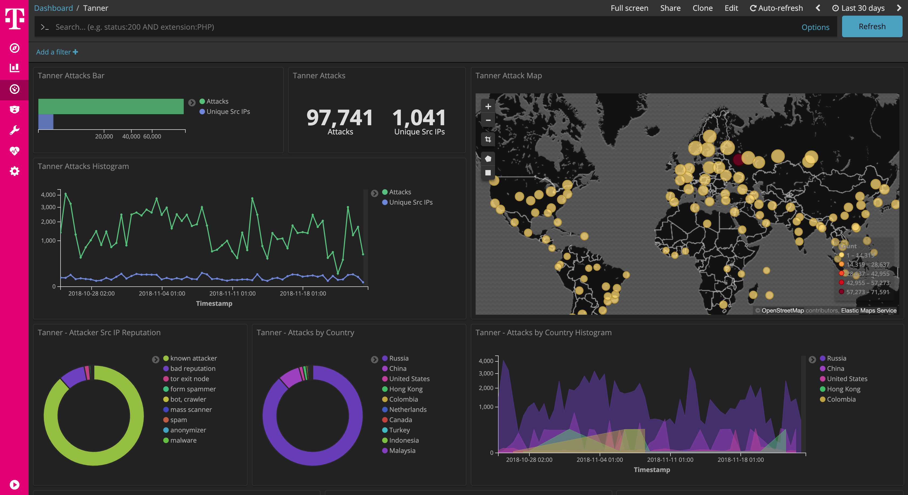

 

# Snare / Tanner

[Tanner](https://github.com/mushorg/tanner) TANNER is a remote data analysis, and classification service, to evaluate HTTP requests and composing the response then served by SNARE events.

This dockerized version is part of the **[T-Pot community honeypot](http://dtag-dev-sec.github.io/)** of Deutsche Telekom AG.

The `Dockerfile` contains the blueprint for the dockerized tanner and will be used to setup the docker image.

The `docker-compose.yml` contains the necessary settings to test tanner using `docker-compose`. This will ensure to start the docker container with the appropriate permissions and port mappings.

# tanner Dashboard

